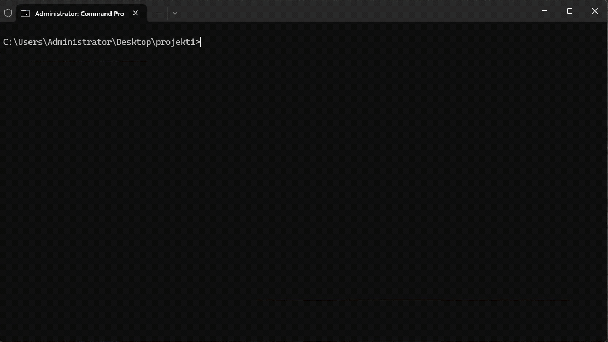

# Assignment 01

How to return assignments? See instructions in the main [README.md](../README.md)!

## Upload following Lecture Notes

- `studentnumber-assignment01-lecture01.pdf`
- `studentnumber-assignment01-lecture02.pdf`
- `studentnumber-assignment01-lecture03.pdf`
- `studentnumber-assignment01-lecture04.pdf`
- `studentnumber-assignment01-lecture05.pdf`
- `studentnumber-assignment01-lecture06.pdf`
- `studentnumber-assignment01-lecture07.pdf`

## Points

| Exercise                           | Points |
| ---------------------------------- | ------ |
| 01: Compiling and Running Apps     | 1      |
| 02: Stack vs Heap Point            | 7      |
| 03: Encapsulation                  | 5      |
| 04: Using `const` in Encapsulation | 4      |
| 05: Using public member function   | 5      |
| 06: Constructors                   | 4      |
| 07: Operators and toString         | 4      |
| 08: BankAccount (integration)      | 13     |
| **Total**                          | **43** |

## 01: Compiling and Running Apps

> You may have done this already, but do it again.

---

- 📺 Lecture: About Tooling]
- 📺 Lecture: Intro to OO and Circle Class] ✏️
  - `studentnumber-assignment01-lecture01.pdf`

---

| Test                                                        | Points |
| ----------------------------------------------------------- | ------ |
| App compiles, outputs "hello world", and `screenshot.png` exists | 1      |
| **Total**                                                   | **1**  |

Compile an app that outputs _"hello world"_ to console (use name `main.cpp`). [Use Docker, Nano and Clang for this.](../env/README.md)

Like following:



Take a screenshot of your programming environment (docker + editor) and return also that with a name of `screenshot.png`

### Test

See [test.sh](01/test.sh). Test your app:

```bash
./test.sh
Test OK!
```

If you get an error about permissions, give permissions to the `test.sh`:

```
chmod +x test.sh
```

## 02: Stack vs Heap Point

---

- 📺 Lecture: Splitting Circle Class ✏️
  - `studentnumber-assignment01-lecture02.pdf`
- 📺 Lecture: Stack and Heap ✏️
  - `studentnumber-assignment01-lecture03.pdf`

---

| Test                                | Points |
| ----------------------------------- | ------ |
| `Point.cpp` exists and is non-empty | 1      |
| `01.txt` exists and is non-empty    | 1      |
| `02.txt` exists and is non-empty    | 1      |
| `03.txt` exists and is non-empty    | 1      |
| `04.txt` exists and is non-empty    | 1      |
| `05.txt` exists and is non-empty    | 1      |
| Point exposes public `x`/`y` fields | 1      |
| **Total**                           | **7**  |

Work in `02/main.cpp`, `02/Point.h`, and `02/Point.cpp`.

1. Define a class named `Point` with two public integer members: `x` and `y`.
2. In `main`, create a `Point` object on the stack named `p`.
3. Print `p.x` and `p.y` before assigning any values.
   - Q1: What do you see and why?
4. Assign after this `p.x = 10` and `p.y = 20`.
5. Print `p.x` and `p.y` again.
   - Q2: What do you see now and why?
6. Create a `Point` object on the heap using `new` and store the pointer in `hp`.
7. Print `x` and `y` before assigning any values.
   - Q3: What do you see and why?
8. Print the pointer value `hp` itself.
   - Q4: What does this output represent and why?
9. Assign values to the heap object fields using both forms of member access using: 1) dereference member access and 2) arrow operator.
   - Q5: Why do both forms work, and how are they related?
10. Print the heap object's `x` and `y` after assignment.
11. Free the heap object to avoid a memory leak.

### Deliverable

Submit `02/main.cpp`, `02/Point.h`, and `02/Point.cpp`. Also short answers to Q1, Q2, Q3, Q4, and Q5 in separate files named `01.txt`, `02.txt`, `03.txt`, `04.txt`, and `05.txt`.

### Test

See [test.cpp](02/test.cpp). Test your app:

```bash
clang++ -std=c++20 02/test.cpp 02/Point.cpp -o 02/test && 02/test
```

## 03: Encapsulation

---

- 📺 Lecture: Encapsulation ✏️
  - `studentnumber-assignment01-lecture04.pdf`

---

| Test                             | Points |
| -------------------------------- | ------ |
| `setX` rejects negative values   | 1      |
| `setX` accepts valid values      | 1      |
| `getX` returns assigned value    | 1      |
| `setY` throws on negative values | 1      |
| `getY` returns assigned value    | 1      |
| **Total**                        | **5**  |

Work in `03/main.cpp`, `03/Point.h`, and `03/Point.cpp`. Copy and paste your previous solution here.

1. Add public getter and setter functions: `getX`, `setX`, `getY`, `setY`.
   - Getters return `int` and are **not** `const` (that is introduced in exercise 04).
   - `setX` returns `bool`; `setY` returns `void`.
2. In `main`, create a `Point` object.
3. Use the setters to assign values, then use the getters to print them.
4. Add validation in the setters using two different approaches:
   - Approach A: return a `bool` to indicate success or failure, implement in `setX()`
   - Approach B: throw an exception when the input is invalid, implement in `setY()`
5. Test both approaches in `main` with valid and invalid values.
   - Invalid value: less than 0.

### Deliverable

Submit `03/Point.cpp`, `03/Point.h`, `03/main.cpp`

### Test

See [test.cpp](03/test.cpp). Test your app:

```bash
clang++ -std=c++20 03/test.cpp 03/Point.cpp -o 03/test && 03/test
```

## 04: Using `const` in Encapsulation

---

- 📺 Lecture: Using const ✏️
  - `studentnumber-assignment01-lecture05.pdf`

---

| Test                             | Points |
| -------------------------------- | ------ |
| `getX` returns assigned value    | 1      |
| `getY` returns assigned value    | 1      |
| `const Point` exposes getters    | 1      |
| `Point* const` can modify object | 1      |
| **Total**                        | **4**  |

`const` means a value cannot be modified after it is initialized. For basic variables, it makes them read-only, so assignments after initialization are rejected by the compiler. In class methods, adding `const` means the method does not modify the object's state; it can be called on `const` objects and cannot change non-mutable members.

Work in `04/main.cpp`, `04/Point.h`, and `04/Point.cpp`. Do not paste code from elsewhere; implement each step yourself.

1. Define a class named `Point` with two private integer members: `x` and `y` in `04/Point.cpp`.
2. Add public getters marked `const`: `getX`, `getY`.
3. Add public setters that return `void`: `setX`, `setY`.
4. In `main`, create a `Point` object and set values using the setters.
5. Create a `const Point` copy of that object.
6. Print both objects using the getters.
7. Try to call a setter on the `const Point` and observe the compiler error (comment it out afterward).
8. Temporarily add `const` to one setter signature and observe the compiler error, then remove `const`.
9. Create these pointer variants and test what you can and cannot modify:
   - `const Point* p1`
   - `Point* const p2`
   - `const Point* const p3`
     Write a brief note in `04.txt` describing the difference.
10. Prefer a header: create `04/Point.h` and include it in `04/main.cpp` like this:
    ```cpp
    #include "Point.h"
    ```
    If you do not want to use a header, you may include `04/Point.cpp` directly:
    ```cpp
    #include "Point.cpp"
    ```

### Deliverable

Submit `04/Point.cpp`, `04/Point.h`, `04/main.cpp`, and a short note in `04.txt` explaining why `const` is needed on getters.

### Test

See [test.cpp](04/test.cpp). Test your app:

```bash
clang++ -std=c++20 04/test.cpp 04/Point.cpp -o 04/test && 04/test
```

## 05: Using public member function

---

| Test                                                       | Points |
| ---------------------------------------------------------- | ------ |
| `moveBy` adds deltas to position                           | 1      |
| `setX` throws on negative values                           | 1      |
| `setY` throws on negative values                           | 1      |
| `moveBy` allows negative deltas if final position is valid | 1      |
| `moveBy` throws if final position would be negative        | 1      |
| **Total**                                                  | **5**  |

Copy previous solution to `05/main.cpp`, `05/Point.h`, and `05/Point.cpp`.

1. Add a public member function `moveBy(int dx, int dy)` that updates `x` and `y`.
2. Validate inputs inside `setX` and `setY`: if the final value is less than 0, throw an exception.
3. Use the setters inside `moveBy` so validation is centralized (negative `dx`/`dy` is allowed if the final position is non-negative).
4. In `main`, create a `Point`, set initial values, call `moveBy` with valid and invalid values, and print results.

### Deliverable

Submit `05/Point.cpp`, `05/Point.h`, `05/main.cpp`.

### Test

See [test.cpp](05/test.cpp). Test your app:

```bash
clang++ -std=c++20 05/test.cpp 05/Point.cpp -o 05/test && 05/test
```

## 06: Constructors

---

- 📺 Lecture: Using Constructors ✏️
  - `studentnumber-assignment01-lecture06.pdf`

---

| Test                                   | Points |
| -------------------------------------- | ------ |
| Default constructor sets `x`/`y` to 0  | 1      |
| Parameterized constructor sets `x`/`y` | 1      |
| `moveBy` adds deltas to position       | 1      |
| Constructor throws on negative values  | 1      |
| **Total**                              | **4**  |

Copy previous solution to `06/main.cpp`, `06/Point.h`, and `06/Point.cpp`.

1. Add a default constructor that initializes `x` and `y` to `0`.
2. Add a parameterized constructor that takes `int x` and `int y` and initializes the fields.
3. Use a member initializer list for both constructors.
4. Validate in the parameterized constructor: throw an exception if `x` or `y` is negative.
5. In `main`, create a `Point` using the default constructor and print its values.
6. Create a `Point` using the parameterized constructor and print its values.

### Deliverable

Submit `06/Point.cpp`, `06/Point.h`, `06/main.cpp`.

### Test

See [test.cpp](06/test.cpp). Test your app:

```bash
clang++ -std=c++20 06/test.cpp 06/Point.cpp -o 06/test && 06/test
```

## 07: Operators and toString

---

- 📺 Lecture: Operation overload ✏️
  - `studentnumber-assignment01-lecture07.pdf`

---

| Test                                    | Points |
| --------------------------------------- | ------ |
| `toString` format                       | 1      |
| `operator<<` matches `toString`         | 1      |
| `operator==` false for different points | 1      |
| `operator+` sums coordinates            | 1      |
| **Total**                               | **4**  |

Copy previous solution to `07/main.cpp`, `07/Point.h`, and `07/Point.cpp`.

1. Add a `toString()` method that returns exactly `Point(x, y)` (e.g. `Point(1, 2)`).
2. Overload `operator<<` so `std::cout << p;` prints the same as `toString()`.
3. Overload `operator==` to compare two points by `x` and `y`.
4. Overload `operator+` to add two points (sum of `x` and `y`).
5. In `main`, create a few points and demonstrate `toString()`, `operator<<`, `operator==`, and `operator+`.

### Deliverable

Submit `07/Point.cpp`, `07/Point.h`, `07/main.cpp`.

### Test

See [test.cpp](07/test.cpp). Test your app:

```bash
clang++ -std=c++20 07/test.cpp 07/Point.cpp -o 07/test && 07/test
```

## 08: BankAccount (integration)

---

| Test                             | Points |
| -------------------------------- | ------ |
| Default constructor values       | 1      |
| `toString` for empty owner       | 1      |
| Parameterized constructor values | 1      |
| `deposit` rejects non-positive   | 1      |
| `deposit` increases balance      | 1      |
| `withdraw` rejects overdraw      | 1      |
| `withdraw` decreases balance     | 1      |
| `operator==` compares by `id`    | 1      |
| `operator+` combines balances    | 1      |
| `operator+` owner and id         | 1      |
| `operator<<` matches `toString`  | 1      |
| `setId` throws on negative       | 1      |
| `setBalance` throws on negative  | 1      |
| **Total**                        | **13** |

---

Create a new class named `BankAccount`. Do not reuse `Point`.

Work in `08/main.cpp`, `08/BankAccount.h`, and `08/BankAccount.cpp`.

1. Fields (private): `std::string owner`, `int id`, `double balance`.
2. Constructors:
   - Default constructor: owner = `""`, id = `0`, balance = `0.0`.
   - Parameterized constructor: initialize all fields using a member initializer list.
3. Getters: `getOwner`, `getId`, `getBalance` (all `const`).
4. Setters: `setOwner`, `setId`, `setBalance` with validation:
   - `id` must be >= 0
   - `balance` must be >= 0.0
5. Methods:
   - `deposit(double amount)`: add amount if amount > 0, return `bool` for success.
   - `withdraw(double amount)`: subtract amount if amount > 0 and enough balance, return `bool`.
6. `toString() const`: return `BankAccount("owner", id, balance)` — the owner field is always quoted.

   ```cpp
   std::string toString() const {
       return "BankAccount(\"" + owner + "\", " + std::to_string(id) + ", " + std::to_string(balance) + ")";
   }
   ```

7. Operators:
   - `operator==`: compare by `id`.
   - `operator+`: return a new account with combined balances and owner `"combined"`, id `0`.
   - `operator<<`: print the same as `toString()`.
8. Use the following `main.cpp`:

```cpp
#include <iostream>
#include "BankAccount.h"

int main() {
    BankAccount a;
    // BankAccount("", 0, 0.000000)
    std::cout << a << std::endl;

    BankAccount b("Alice", 42, 100.0);
    // BankAccount("Alice", 42, 100.000000)
    std::cout << b.toString() << std::endl;

    b.deposit(50.0);
    b.withdraw(30.0);
    // After transactions: BankAccount("Alice", 42, 120.000000)
    std::cout << "After transactions: " << b << std::endl;

    BankAccount d("Bob", 7, 25.0);
    // b == d? 0
    std::cout << "b == d? " << (b == d) << std::endl;

    BankAccount combined = b + d;
    // Combined: BankAccount("combined", 0, 145.000000)
    std::cout << "Combined: " << combined << std::endl;

    return 0;
}
```

### Deliverable

Submit `08/BankAccount.cpp`, `08/BankAccount.h`, `08/main.cpp`.

### Test

See [test.cpp](08/test.cpp). Test your app:

```bash
clang++ -std=c++20 08/test.cpp 08/BankAccount.cpp -o 08/test && 08/test
```
