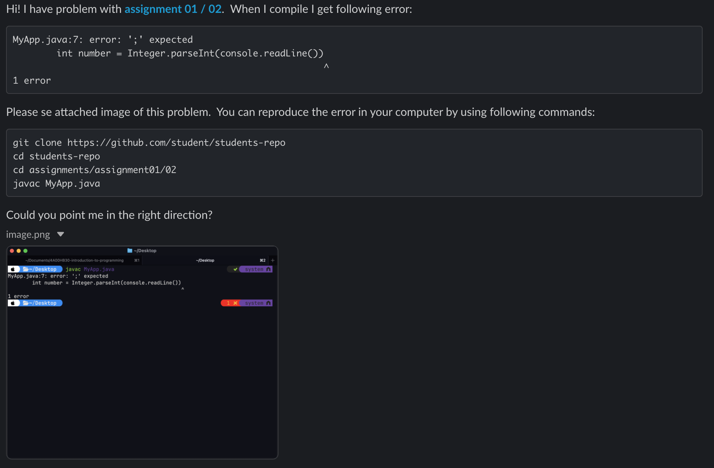
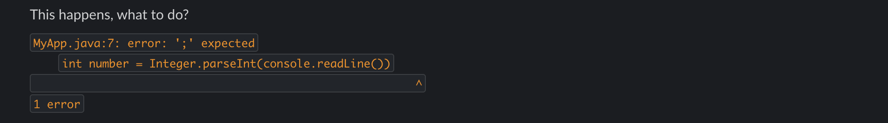

# Communication

- ⚠️ **Preferred method:** Use **Slack** for communication if it's available.
- ⚠️ **For security-sensitive matters:** Use **email** instead.

## Best Practices for Asking Programming Questions on Slack

> Helping you get faster, better answers by asking smart questions.

To facilitate effective and efficient communication on Slack, especially regarding programming questions, follow these guidelines when seeking assistance.

### Good Example of Slack usage:



### Bad Example of Slack usage:



### Best Practices for contacting via Email

- Please use `[course identifier]` in your subject line!
- Example `[4A00HB30-2002] Question about Assignment 01 / 02 (while-loops)

Why?

1. **Many courses, many students** - Teachers often handle several different courses and hundreds of students. Without a clear course code in the subject line, it 's hard to know which course the message relates to, especially if the email only says "Question about assignment."
2. **Inbox filtering and searching** - with `[course identifier]`, emails can be automatically sorted or searched later. For instance, filtering all messages with `[4A00HB30-2002]` helps the teacher group all course-related communication quickly.
3. **Faster responses** - When the teacher instantly knows which course and topic the message concerns, they can answer more efficiently, rather than wasting time trying to identify context.
4. **Professional communication practice** - It teaches students a good habit used in workplaces and academia: structuring subject lines for clarity. This mirrors real-world expectations in professional correspondence.
5. **Consistency** - If everyone follows the same format, communication stays clean and manageable, reducing misunderstandings and lost messages.

### Good example

```
Subject: [4A00HB30-2002] Question about Assignment 01 / 02 (while-loops)

Hello,

I'm having difficulties with Assignment 01 / 02 in the course 4A00HB30-2002 Java
Fundamentals. Specifically, I don't understand how to set up the while loop
so that it stops when the user enters 0. I tried adapting the example from
the lecture notes, but my program still runs endlessly.

The assignment instructions are available here:

https://...

My current solution attempt is available here:

https://...

You can download and run the app with following commands:

git clone https://...
cd foo/bar/assignments/01/02
javac Main.java && java Main

Would it be possible for you to point out what I should focus on,
or could we briefly go through it in the next class?

Best regards,

Max Power
Student number: 123245
Group: 25TIKOOT1
```

---

### 1️⃣ Be Clear and Concise

- **State Your Objective:** Begin with a clear statement of what you're trying to achieve or the problem you're facing.
- **Assignment Context:** Mention what assignment and exercise you're working on.
- **Provide a Link:** Include a link to the assignment if available.

### 2️⃣ Provide Necessary Details

- **Error Messages:** Include any error messages or output that you're encountering, verbatim.
- **Relevant Code:** Share only the relevant portion of your code that is causing the issue. Use proper formatting.
- **Command Used:** Share the command you used, where you ran it, and what it returned.
- **What You've Tried:** Mention what solutions or debugging steps you've already attempted.
- **GitHub Repository:** Provide a link to your GitHub repo so others can explore the full code context if needed.

### 3️⃣ Format Your Question Properly

- **Code Blocks:** Use Slack's code block (triple backticks ```) for sharing code or error messages to improve readability.
- **Screenshots:** Include screenshots when necessary, but prefer text for logs and code snippets so they can be copied and searched.

### 4️⃣ Tag People and Use Channels Wisely

- **Relevant Channels:** Post your question in the most appropriate channel.
- **Direct Messages:** Use DMs for specific queries, but respect the recipient's time and availability.

### 5️⃣ Follow Up and Give Feedback

- **Update the Thread:** If you solve the issue, post your solution or a summary.
- **Appreciation:** Acknowledge the help you receive. It encourages community support.

### 6️⃣ Respect Everyone's Time

- **Initial Research:** Try solving the problem yourself using documentation or search engines.
- **Be Patient:** Helpers have their own tasks and responsibilities.
- **Reproducibility:** Give exact steps to reproduce the issue, including necessary commands like:

  ```sh
  git clone https://url-to-repository && cd path/to/assignment && compile-command && run-command
  ```

---
