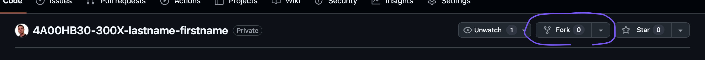
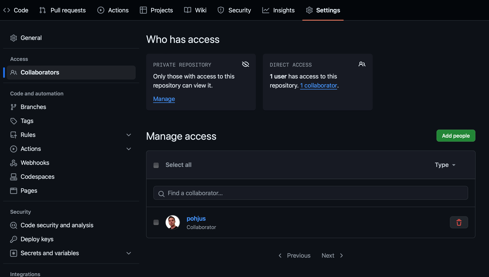
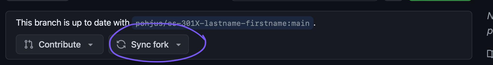

# 📂 Git Instructions

Log in with your account to [GitHub](http://github.com).

Open the GitHub url your teacher has given to you (should be in Google Sheets). You should have access to this private repository.

⚠️ Permissions to this repo has been added to students who have github account name in **Google Sheets** ⚠️

Click the “fork” button.



A GitHub repository fork is a personal copy of someone else's repository that exists in your GitHub account. Forking a repository _allows you to make changes to the original codebase without affecting the original repository_.

When you fork a repository, you create a new repository under your GitHub account that contains all the files and history of the original repository.

When the original repository (often referred to as the _"upstream"_ -repository) is changed—whether through new commits, updates, or other modifications—you can pull those changes into your forked repository to keep it up to date. This process involves fetching the latest changes from the original repository and then merging them into your fork.

So basically when teacher adds new assignment to the original github repo, you can pull those to your forked repo.

- Change the repository name to reflect your course and name, for example:
  - `https://github.com/pohjus/4A00HB30-300X-introduction-to-programming-lastname-firstname`
    - Notice `lastname-firstname`, not
      - `firstname-lastname` or
      - `Lastname-Firstname` or
      - `Firstname-Lastname`
    - Notice to change the number `300X` to reflect your course.
    - If you make a mistake, you can change this later on in repo settings.
- Click _Create fork_

Then check that pohjus is collaborator, if not, then add:



⚠️ REMOVE ALL OTHER collaborators! ⚠️, to do this, select all and then deselect `pohjus`.

Now you can clone the forked repo to your computer:

```sh
git clone https://github.com/....
```

And add your assignment:

```sh
git add -A
git commit -m "message"
git push
```

If you want the latest updates and assignment files from the teacher use the sync fork button.



Add also you repository link to your Google Sheets.

## Tips: Merge conflict?

Conflicts can happen if you and the teacher changed the same file.
Typical cases:

- You both edited the same line.
- Teacher deleted a file that you edited.
- Teacher renamed/moved a file that you edited.

If you worked in completely different files or lines, Git can merge automatically - no conflict.

In CLI you could try to do:

```
# Tell Git where the teacher's repo is (do this once per clone)
git remote add upstream https://github.com/pohjus/4A00HB30-introduction-to-programming.git

# Get the newest changes from teacher’s repo
git fetch upstream

# Go to your own main branch
git switch main

# Put your work on top of teacher’s latest changes
git rebase upstream/main

# If there is a conflict:
# 1) Open the file that shows conflict
# 2) Find <<<<<<< ======= >>>>>> and edit to the correct code
# 3) Save, then stage the fix:
git add <filename>

# Tell Git to continue the rebase (repeat add/continue if more conflicts)
git rebase --continue

# Update your fork on GitHub (safe force push)
git push --force-with-lease
```

OR

- If having merge conflict, you can also try to use:
  - Go to your fork on GitHub.
  - Click on "Pull requests".
  - Start a new pull request.
  - Set the base to your fork’s main, and the compare to upstream/main.
  - Example:
    - base: `student/main`
    - compare: `pohjus/main` (upstream)
  - This creates a pull request from upstream into the fork — essentially asking to pull the changes from the original repo into the fork.
