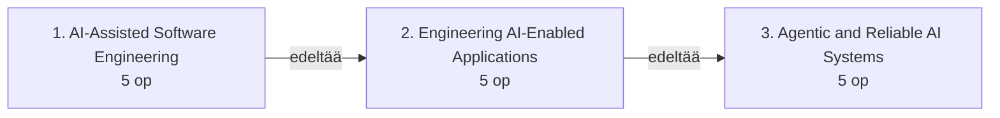

# Tekoälyavusteisen ohjelmistokehityksen opintojaksokokonaisuus

Osallistujilta edellytetään ICT-alan AMK-tutkintoa.

Opintojaksokokonaisuudessa harjoitellaan generatiivisen tekoälyn hyödyntämistä
ohjelmistokehityksen eri vaiheissa. Opiskelija oppii määrittelemään ja
rajaamaan kehitystehtäviä, hallitsemaan tekoälylle annettavaa kontekstia sekä
käyttämään tekoälyä toteutuksessa, testauksessa ja koodikatselmoinnissa.
Olennaista on myös varmistaa tuotosten laatu ja tunnistaa kielimallien
rajoitukset. Työskentelyssä otetaan huomioon tietoturva, tietosuoja,
jäljitettävyys ja ohjelmistokehittäjän vastuu.

## Opintojaksot lyhyesti

### AI-Assisted Software Engineering, 5 op

Opiskelija käyttää generatiivista tekoälyä ohjelmistokehityksen työvälineenä.
Hän määrittelee tehtävät ja tekoälylle annettavan kontekstin, toteuttaa ja testaa
ohjelmistomuutoksia, varmistaa työnsä laadun ja toimii vastuullisesti.

### Engineering AI-Enabled Applications, 5 op

Opiskelija rakentaa sovellukseen rajattuja tekoälyominaisuuksia. Hän liittää
kielimallin tietolähteisiin ja työkaluihin sekä arvioi ratkaisun laatua,
kustannuksia, turvallisuutta ja luotettavuutta.

### Agentic and Reliable AI Systems, 5 op

Opiskelija rakentaa rajatun yhden agentin järjestelmän, joka käyttää työkaluja
ja etenee monivaiheisessa tehtävässä. Hän määrittelee agentin autonomian ja
käyttöoikeudet sekä arvioi koko toimintaketjun jäljitettävyyttä ja
tuotantovalmiutta.

### Opintojaksojen eteneminen

Taulukko kokoaa yhteen opintojaksojen työnjaon.

| Näkökulma | AI-Assisted Software Engineering | Engineering AI-Enabled Applications | Agentic and Reliable AI Systems |
| --- | --- | --- | --- |
| Tekoälyn rooli | Kehittäjän ohjaama työväline | Sovelluksen yksittäinen ominaisuus tai komponentti | Rajattu agentti, joka toteuttaa monivaiheisen tehtävän |
| Työkalujen käyttö | Ohjelmointiagentti muokkaa koodia ja käyttää kehitystyökaluja kehittäjän valvonnassa | Kielimalli ehdottaa työkalukutsua, jonka sovellus tarkistaa ja suorittaa | Agentti valitsee sallituista työkaluista, ylläpitää tilaansa ja etenee rajatussa toimintasilmukassa |
| Testaus ja arviointi | Ohjelmistomuutoksen laatu varmistetaan hyväksymiskriteereillä, testeillä ja katselmoinnilla | Yksittäisen tekoälyominaisuuden vastauksia arvioidaan toistettavan aineiston ja ennalta määriteltyjen kriteerien avulla | Lopputulosta, työkaluvalintoja, toimintaketjua ja virheistä palautumista arvioidaan |
| Turvallisuus ja vastuu | Kehittäjä suojaa lähdekoodin ja aineistot, tarkistaa tuotosten alkuperän ja käyttöehdot sekä hyväksyy muutokset | Syötteet ja vastaukset tarkistetaan; epäluotettavaa sisältöä ja häiriötilanteita hallitaan ominaisuuden tasolla | Käyttöoikeuksia rajataan, työkalutuloksia käsitellään epäluotettavina ja merkittävät toimet edellyttävät ihmisen hyväksyntää |
| Tuotantovalmius | Laadunvarmistettu ja versionhallintaan tallennettu ohjelmistomuutos | Yksittäisen ominaisuuden virheenkäsittely, lokitus sekä kustannusten ja vasteajan seuranta | Agenttisen järjestelmän tuotantovalmiuden puuteanalyysi ja sen perusteella valitut hallintakeinot |
| Osaamisen näyttö | Tekoälyn avulla toteutettu ohjelmistomuutos, jonka laatu on varmistettu | Sovellus, jossa on rajatut RAG- ja työkalukutsuratkaisut; niistä toista syvennetään ja arvioidaan | Rajattu ja havainnoitava yhden agentin järjestelmä, jossa on valitut hallintakeinot |

---

## AI-Assisted Software Engineering, 5 op

### Tavoite

Opintojakson tavoitteena on antaa opiskelijalle valmiudet hyödyntää
generatiivista tekoälyä järjestelmällisesti ja tarkoituksenmukaisesti osana
ohjelmistokehitystä.

Opintojakson suoritettuaan opiskelija:

- selittää suurten kielimallien keskeiset toimintaperiaatteet sekä tunnistaa
  niiden mahdollisuudet, rajoitukset ja riskit ohjelmistokehityksessä
- vertailee tekoälyavusteisia työskentelytapoja ja perustelee työskentelytavan
  valinnan tehtävän vaatimusten perusteella
- määrittelee tehtävän vaatimukset, rajaukset ja hyväksymiskriteerit sekä
  valitsee ja rajaa tekoälylle annettavan kontekstin
- hyödyntää tekoälyä ohjelmiston toteutuksessa, testauksessa ja
  koodikatselmoinnissa sekä soveltaa samoja periaatteita olemassa olevan
  ohjelmiston analysointiin ja muuttamiseen
- arvioi tekoälyn tuottamia ratkaisuja ja varmistaa niiden laadun määrittelyjen,
  testien, katselmoinnin ja versionhallinnan avulla
- perustelee, mistä ohjelmistokehittäjä vastaa, ja soveltaa tietoturvaa,
  tietosuojaa, tekijänoikeuksia, lisenssiehtoja ja jäljitettävyyttä koskevia
  käytäntöjä sekä tunnistaa saavutettavuuteen ja vinoumiin liittyviä riskejä.

### Sisältö

#### Generatiivinen tekoäly ohjelmistokehityksessä

Opiskelija selittää generatiivisen tekoälyn ja suurten kielimallien
toimintaperiaatteet ohjelmistokehittäjän tarvitsemalla tarkkuudella. Aiheisiin
kuuluvat syöteyksiköt (tokenit), konteksti ja konteksti-ikkuna, mallien
todennäköisyyspohjainen toiminta, vahvuudet ja rajoitukset sekä virheellisten tai
epäluotettavien vastausten syntyminen. Opiskelija tarkastelee myös
generatiivisen tekoälyn vaikutuksia ohjelmistokehittäjän työhön ja vertailee
tapoja käyttää tekoälyavustimia ja ohjelmointiagentteja (coding agents) osana
ohjelmistokehitystä.

#### Tekoälyavusteisen kehittämisen työnkulut ja kontekstin hallinta

Opiskelija suunnittelee ja ohjaa tekoälyavusteisen ohjelmistokehitystehtävän.
Hän määrittelee tavoitteet, vaatimukset, rajaukset ja hyväksymiskriteerit,
pilkkoo tehtävän osiin ja välittää tekoälylle ohjelmistoprojektin
tietovarastosta (repository) tarvittavan kontekstin. Harjoituksissa sovelletaan
suunnitelmallista ja iteratiivista työskentelyä sekä hallitaan kontekstia
pitkissä kehitystehtävissä. Liiallinen, epäolennainen tai vanhentunut konteksti
voi heikentää työskentelyn laatua.

#### Tekoäly ohjelmiston toteutuksessa, ylläpidossa ja modernisoinnissa

Opiskelija hyödyntää tekoälyä uusien ohjelmistojen kehittämisessä sekä olemassa
olevien järjestelmien ylläpidossa ja muuttamisessa. Hän analysoi ohjelmistoa ja
lähdekoodia, suunnittelee ja toteuttaa uusia ominaisuuksia, arvioi muutosten
vaikutuksia sekä etsii virheitä. Lisäksi käsitellään refaktorointia, vanhan
ohjelmakoodin (legacy code) modernisointia ja dokumentointia. Ennen muutosten
hyväksymistä opiskelija tarkastaa tekoälyn ehdottamat muutokset versionhallinnan
ja tavallisten kehitystyökalujen avulla.

#### Määrittely- ja testilähtöinen tekoälyavusteinen kehittäminen

Opiskelija toteuttaa ohjelmistomuutoksen siten, että tehtävän määrittely,
hyväksymiskriteerit ja testit ohjaavat tekoälyn käyttöä. Hän muotoilee
vaatimukset testattaviksi, tuottaa ja arvioi testejä sekä vertaa toteutusta
määrittelyihin. Sisältöön kuuluvat yksikkö-, integraatio- ja hyväksymistestit
sekä poikkeus- ja rajatapaukset. Automaattiset tarkistukset muodostavat
palautekierroksen, jossa tekoäly suorittaa testin, havaitsee epäonnistumisen ja
korjaa toteutusta.

#### Tekoälyavusteinen koodikatselmointi ja ohjelmiston laadunvarmistus

Tekoälyn avulla tarkastellaan ohjelmakoodin oikeellisuutta, ymmärrettävyyttä,
ylläpidettävyyttä, suorituskykyä, riippuvuuksia ja tietoturvaa. Opiskelija arvioi
kriittisesti sekä tekoälyn tuottamaa ohjelmakoodia että sen tekemiä
koodikatselmointihavaintoja. Ratkaisua tai arviota ei hyväksytä pelkän
uskottavuuden perusteella, vaan sen oikeellisuus osoitetaan ohjelmistoteknisin
keinoin.

#### Turvallinen ja vastuullinen tekoälyavusteinen ohjelmistokehitys

Opiskelija arvioi tekoälyavusteista ohjelmistokehitystä tietoturvan,
tietosuojan ja vastuullisuuden näkökulmista. Aiheisiin kuuluvat
luottamuksellisen lähdekoodin ja organisaation tietojen käsittely,
tekoälypalveluun välitettävät tiedot, ohjelmointiagenttien käyttöoikeudet ja
komentojen suorittaminen sekä tekoälyn ehdottamien riippuvuuksien ja ulkoisten
kirjastojen tarkistaminen. Opiskelija selvittää tekoälyn tuottaman koodin
alkuperän, tekijänoikeudet ja lisenssiehdot, dokumentoi käyttämänsä lähteet ja
tekemänsä muutokset sekä tunnistaa saavutettavuuteen ja vinoumiin liittyviä
riskejä. Lisäksi tarkastellaan tekoälyn autonomian rajaamista
ohjelmistokehityksessä. **Ohjelmistokehittäjä vastaa myös tekoälyn tuottamien
muutosten hyväksymisestä.**

---

## Engineering AI-Enabled Applications, 5 op

Opintojakso jatkaa AI-Assisted Software Engineering -opintojaksoa. Siinä
tekoäly ei ole enää vain kehittäjän työväline, vaan osa rakennettavaa
ohjelmistoa. Ensin kielimalli liitetään sovellukseen. Sen jälkeen käsitellään
kontekstin hallintaa, tiedonhakua, työkalukutsuja sekä ratkaisun
järjestelmällistä arviointia ja luotettavuuden parantamista.

Opintojaksolla suunnitellaan ja toteutetaan tekoälyominaisuuksia sisältäviä
sovelluksia. Luotettavuutta, tietoturvaa ja arviointia tarkastellaan yhden
mallikutsun tai yksittäisen tekoälyominaisuuden tasolla. Agenttiarkkitehtuurit,
MCP-yhteyskäytännön (Model Context Protocol) laajempi hyödyntäminen, agenttien
orkestrointi ja agenttijärjestelmien tuotantovalmiuden arviointi kuuluvat
seuraavaan opintojaksoon.

### Tavoite

Opintojakson tavoitteena on antaa opiskelijalle valmiudet suunnitella ja
toteuttaa ohjelmistoja, joissa generatiivinen tekoäly toimii osana sovelluksen
toimintaa.

Opintojakson suoritettuaan opiskelija:

- vertailee tapoja integroida kielimalleja sovellukseen ja perustelee mallin,
  rajapinnan ja arkkitehtuurin valinnan
- toteuttaa tekoälyominaisuuden, jossa käytetään kielimallin
  ohjelmointirajapintaa ja hallittua kontekstia ja jonka vastaukset ovat
  rakenteisia ja tarkistettavissa
- liittää kielimallin tiedonhaun avulla sovelluksen omaan tai ulkoiseen tietoon
  ja toteuttaa sovelluksen hallitseman työkalukutsun
- määrittelee tehtäväkohtaiset onnistumiskriteerit ja arviointiaineiston sekä
  mittaa ratkaisun laatua, kustannuksia ja vasteaikaa
- analysoi generatiiviseen tekoälyyn perustuvan ominaisuuden
  epädeterminististä toimintaa sekä toteuttaa ratkaisut, joilla ominaisuutta
  testataan, rajataan ja valvotaan
- tarkistaa ratkaisun syötteet ja vastaukset, soveltaa tietoturvaa, tietosuojaa
  ja jäljitettävyyttä koskevia käytäntöjä sekä tunnistaa saavutettavuuteen ja
  vinoumiin liittyviä riskejä.

### Sisältö

#### Kielimalli osana ohjelmistoarkkitehtuuria

Opiskelija käyttää kielimalleja ohjelmointirajapintojen (API) ja
ohjelmistokehityspakettien (SDK) avulla sekä sijoittaa kielimallin osaksi
sovellusarkkitehtuuria. Käsiteltäviä aiheita ovat mallin valinta, pyyntöjen ja
vastausten rakenne, tilan hallinta, suoratoisto, virheenkäsittely, vasteaika ja
kustannukset. Opiskelija vertailee pilvipohjaisia ja paikallisesti suoritettavia
malleja. Hän perustelee, milloin generatiivinen tekoäly sopii osaksi
ohjelmistoratkaisua ja milloin tehtävä kannattaa ratkaista perinteisellä
ohjelmakoodilla. Generatiivisen tekoälyn käytön on perustuttava ratkaistavan
ongelman vaatimuksiin.

#### Kontekstin hallinta ja rakenteiset vastaukset

Opiskelija muodostaa kielimallille tarkoituksenmukaisen kontekstin ja käyttää
mallin tuottamaa tietoa osana ohjelmiston toimintaa. Aiheisiin kuuluvat
järjestelmälle ja sovellukselle annettavat ohjeet, käyttäjän syötteet,
keskusteluhistoria, dynaaminen konteksti sekä kontekstin rajaaminen ja
tiivistäminen. Rakenteiset vastaukset tuotetaan ennalta määriteltyjen
tietorakenteiden mukaisesti. Vapaamuotoisen tekstin sijasta kielimallilta
pyydetään tietoa, jonka sovellus voi tarkistaa ja käsitellä.

#### Tiedonhaku, vektoriupotukset ja RAG

Opiskelija välittää sovelluksen omaa ja ulkoista tietoa kielimallille.
Aiheisiin kuuluvat vektoriupotukset (embeddings), semanttinen haku,
dokumenttien pilkkominen, metadata ja tiedonhaku (retrieval). Opiskelija
rakentaa hakua hyödyntävän generointiratkaisun (retrieval-augmented
generation, RAG) ja analysoi sen vaiheet tiedon käsittelystä hakutulosten
valintaan ja vastauksen muodostamiseen. Hän vertaa hakupohjaista ratkaisua
muihin tapoihin tuoda kielimallille ajantasaista tai sovelluskohtaista tietoa,
kuten tiedon liittämiseen suoraan kontekstiin ja tietokantahakuihin. RAG on yksi
mahdollinen arkkitehtuuriratkaisu, mutta se ei sovi kaikkiin tekoälysovelluksiin.

#### Työkalukutsut ja tekoälyn yhdistäminen ohjelmiston toimintoihin

Opiskelija yhdistää kielimallin ohjelmiston toimintoihin ja ulkoisiin
palveluihin työkalukutsujen (tool calling eli function calling) avulla.
Työkalut kuvataan kielimallille, kutsun parametrit muodostetaan ja tarkistetaan,
kutsu suoritetaan sovelluksessa ja tulos palautetaan mallille. Harjoituksissa
kielimalli yhdistetään esimerkiksi sovelluksen omiin toimintoihin, tietokantaan
tai ulkoiseen ohjelmointirajapintaan. Kielimallin ja deterministisen
ohjelmakoodin tehtävät erotetaan toisistaan. Opiskelija perustelee, mitkä
ratkaisut voidaan jättää mallin tehtäväksi ja mitkä kuuluvat
sovelluslogiikkaan.

Opiskelija toteuttaa sekä rajatun tiedonhakua hyödyntävän generointiratkaisun
että rajatun työkalukutsuratkaisun. **Opintojakson projektissa hän syventää
osaamistaan valitsemassaan aiheessa.**

#### Tekoälysovellusten testaus ja arviointi

**Arviointi kohdistuu yksittäisen tekoälyominaisuuden tuottamiin vastauksiin.**
Opiskelija kokoaa arviointiaineiston ja testitapaukset sekä määrittelee
sovellukselle tehtäväkohtaiset onnistumiskriteerit. Determinististen
ohjelmistotestien lisäksi käsitellään generatiivisten vastausten arviointia,
vertailuvastauksia, automaattista ja ihmisen tekemää arviointia sekä
mallipohjaista arviointia. Opiskelija tunnistaa regressioita ja mittaa laatua,
kustannuksia ja vasteaikaa. Yksittäisten esimerkkikehotteiden kokeilusta
siirrytään toistettavaan ja mitattavaan arviointiin.

#### Tekoälysovellusten luotettavuus, tietoturva ja tuotantovalmius

**Opiskelija suunnittelee yksittäisen mallikutsun tai tekoälyominaisuuden
luotettavuuden ja tietoturvan hallintakeinot.** Syötteet ja mallin vastaukset
tarkistetaan. Samalla käsitellään käyttäjän syötteisiin tai haettuun aineistoon
sisältyviä kehoteinjektioita (prompt injection), jotka voivat vaikuttaa
vastaukseen. Muita aiheita ovat luottamuksellisen tiedon käsittely,
käyttöoikeudet, virheenkäsittely, aikakatkaisut, uudelleenyritykset ja
vaihtoehtoiset toimintatavat tekoälypalvelun häiriöissä. Opiskelija seuraa
syöteyksiköiden käyttöä, kustannuksia ja vasteaikaa sekä määrittelee lokitukseen,
lähteiden jäljitettävyyteen ja tuotantoympäristön hallintaan liittyvät
käytännöt. Lisäksi hän tunnistaa käyttäjälle näkyvistä vastauksista
saavutettavuuteen ja vinoumiin liittyviä riskejä. Kielimallia käsitellään
epävarmana ohjelmistokomponenttina, jonka toimintaa rajataan ja jonka tuottamien
vastausten laatu varmistetaan.

---

## Agentic and Reliable AI Systems, 5 op

Opintojakso jatkaa Engineering AI-Enabled Applications -opintojaksoa ja
laajentaa tarkastelun yksittäisistä tekoälyominaisuuksista agenttisiin,
monivaiheisiin järjestelmiin. Opiskelija määrittelee agentin roolin ja
autonomian, liittää sen työkaluihin sekä hallitsee sen tilaa ja muistia. Lisäksi
hän arvioi järjestelmän havainnoitavuutta ja tuotantovalmiutta.

Opintojaksolla käsitellään agenttiarkkitehtuureja, MCP-pohjaisia integraatioita,
turvallisuutta, havainnoitavuutta ja arviointia. Edellisellä opintojaksolla
opitut luotettavuus-, tietoturva- ja arviointikäytännöt ulotetaan yksittäisestä
mallikutsusta tai tekoälyominaisuudesta koko monivaiheiseen toimintaketjuun.

### Tavoite

Opintojakson tavoitteena on antaa opiskelijalle valmiudet suunnitella ja
toteuttaa agenttisia tekoälyjärjestelmiä. Niissä kielimalli ohjaa monivaiheista
toimintaa ja käyttää ulkoisia työkaluja, tietolähteitä ja palveluita tavoitteen
saavuttamiseksi.

Opintojakson suoritettuaan opiskelija:

- erottaa agentin tavallisesta kielimallikutsusta ja ennalta määritellystä
  työnkulusta sekä perustelee agenttisen ratkaisun tarkoituksenmukaisuuden
- vertailee agenttiarkkitehtuurien hyötyjä, kustannuksia ja monimutkaisuutta
  sekä valitsee käyttötapaukseen sopivan arkkitehtuurin
- toteuttaa rajatun agenttisen järjestelmän, joka käyttää työkaluja, ylläpitää
  tilaa ja muistia sekä käsittelee virhetilanteet ja noudattaa lopetusehtoja
- hyödyntää MCP-yhteyskäytäntöä tai muuta perusteltua integraatiotapaa
  järjestelmän liittämiseen ulkoisiin palveluihin
- määrittelee agentille vähimmät tarvittavat käyttöoikeudet,
  hyväksyntäpisteet ja muut autonomiaa rajaavat hallintakeinot
- toteuttaa järjestelmälle lokituksen ja tapahtumien jäljityksen sekä arvioi
  agentin toimintaa lopputuloksen ja toimintaketjun perusteella
- mittaa järjestelmän laatua, kustannuksia ja suorituskykyä, arvioi
  tuotantokäyttöön liittyvät tietoturvan, jäljitettävyyden ja luotettavuuden
  puutteet sekä toteuttaa niiden perusteella valitut hallintakeinot.

### Sisältö

#### Agenttiset järjestelmät ja agenttinen ohjelmistokehitys

**Opiskelija erottaa agentin tavallisesta kielimallikutsusta ja ennalta
määritellystä ohjelmistotyönkulusta.** Tarkasteltavia asioita ovat agentin
tavoitteet, päätöksenteko, tehtävien pilkkominen, työkalujen valinta,
toimintojen suorittaminen ja tulosten hyödyntäminen seuraavissa vaiheissa.
Opiskelija vertailee deterministisiä työnkulkuja, tekoälyavusteisia työnkulkuja
ja autonomisempia agentteja sekä perustelee, milloin agenttisuudesta on hyötyä
ja milloin se monimutkaistaa järjestelmää tarpeettomasti.

#### Agenttien tila, muisti ja toimintasilmukat

Opiskelija ylläpitää monivaiheisen agentin tilaa, keskustelu- ja
tehtävähistoriaa sekä lyhyt- ja pitkäkestoista muistia. Hän seuraa tehtävän
etenemistä ja toteuttaa toimintasilmukoita, joissa agentti havainnoi tilanteen,
tekee päätöksen, käyttää työkalua ja arvioi saamansa tuloksen. Opiskelija
määrittelee lopetusehdot, aikarajat, toistojen enimmäismäärät ja muut
hallintakeinot, jotta agentin toiminta pysyy rajattuna ja ennakoitavana.

#### Agenttiarkkitehtuurit ja orkestrointi

Opiskelija vertailee tapoja rakentaa agenttisia järjestelmiä. Aiheisiin kuuluvat
yhden agentin ratkaisut, orkestroija–työntekijä-mallit (orchestrator–worker),
suunnittelija–suorittaja-mallit (planner–executor), agenttien käyttäminen
työkaluina, tehtävien välittäminen agentilta toiselle ja
moniagenttiratkaisut. Opiskelija arvioi arkkitehtuurien hyötyjä, kustannuksia ja
monimutkaisuutta sekä tunnistaa tilanteet, joissa yksi hyvin suunniteltu agentti
tai deterministinen työnkulku on usean agentin järjestelmää
tarkoituksenmukaisempi. **Moniagenttiarkkitehtuureja vertaillaan ja
arkkitehtuurivalinta perustellaan, mutta osaamisen näytössä ei edellytetä niiden
toteuttamista.**

#### MCP ja tekoälyjärjestelmien integraatiot

Opiskelija kuvaa MCP-yhteyskäytännön periaatteet ja liittää sen avulla
tekoälyjärjestelmän ulkoiseen tietolähteeseen, työkaluun tai palveluun.
Aiheisiin kuuluvat MCP:n asiakas–palvelin-arkkitehtuuri, työkalujen ja
resurssien tarjoaminen tekoälyjärjestelmälle sekä MCP-palvelimen suunnittelu ja
toteutus.
Opiskelija määrittelee integraation käyttöoikeudet ja luottamusrajat sekä
arvioi, miten organisaation järjestelmiä voidaan antaa agentin käyttöön
hallitusti ja uudelleenkäytettävästi.

#### Agenttien turvallisuus, käyttöoikeudet ja ihmisen hyväksyntä

Opiskelija analysoi agenttisten tekoälyjärjestelmien tietoturvaan ja hallintaan
liittyviä riskejä. Aiheisiin kuuluvat työkalujen käyttöoikeudet, vähimmän
oikeuden periaate (least privilege) sekä työkalun tai ulkoisen palvelun
palauttaman epäluotettavan sisällön käsittely. Tarkasteltavia uhkia ovat
kehoteinjektiot, joissa epäluotettava sisältö ohjaa agentin seuraavaa päätöstä
tai työkalukutsua, sekä haitalliset tai virheelliset työkalukutsut. Opiskelija
rajaa agentin toimintaa ja toteuttaa ratkaisun, jossa ihminen osallistuu
päätöksentekoon (human-in-the-loop) ennalta määritellyissä hyväksyntäpisteissä
(approval gates). **Merkittävät tai peruuttamattomat toiminnot edellyttävät
ihmisen hyväksyntää.** Opiskelija perustelee agentille annetun autonomian
laajuuden järjestelmän käyttötarkoituksen ja riskitason perusteella.

#### Agenttien havainnoitavuus ja arviointi

**Arviointi kohdistuu agentin lopputulokseen ja koko monivaiheiseen
toimintaketjuun.** Näin edellisen opintojakson yksittäisen
tekoälyominaisuuden arviointi laajenee agentin päätöksentekoon ja autonomiaan.
Aiheisiin kuuluvat lokitus, tapahtumien jäljitys (tracing), työkalukutsujen ja
toimintaketjujen seuranta, syöteyksiköiden ja kustannusten seuranta sekä
poikkeavan käyttäytymisen tunnistaminen. Arvioinnissa tarkastellaan
työkaluvalintoja, tehtävän etenemistä ja virheistä palautumista. Opiskelija
rakentaa testitapauksia ja arviointeja järjestelmämuutosten vaikutusten
mittaamiseen ja regressioiden havaitsemiseen.

#### Agenttisten tekoälyjärjestelmien tuotantovalmius

**Tuotantovalmiutta arvioidaan koko agenttisen järjestelmän, ei yksittäisen
ominaisuuden, tasolla.** Opiskelija selvittää, mitä prototyypistä puuttuu
tuotantokäyttöä varten. Arvioitavia asioita ovat monivaiheisen toimintaketjun
virheistä palautuminen, osittain suoritettujen toimintojen käsittely,
aikakatkaisut, uudelleenyritykset, varajärjestelyt (fallback), mallien ja
palveluiden vaihtaminen, suorituskyky, vasteaika sekä kustannusten kertyminen
työkalukutsujen ja toimintakierrosten aikana. Opiskelija toteuttaa arvion
perusteella valitut hallintakeinot. Lisäksi käsitellään tekoälyjärjestelmän
versioinnin ja arvioinnin kytkemistä kehitys- ja julkaisuprosessiin,
tuotantojärjestelmän jatkuvaa seurantaa sekä tuotannosta saatavan tiedon
hyödyntämistä järjestelmän laadun parantamisessa.
