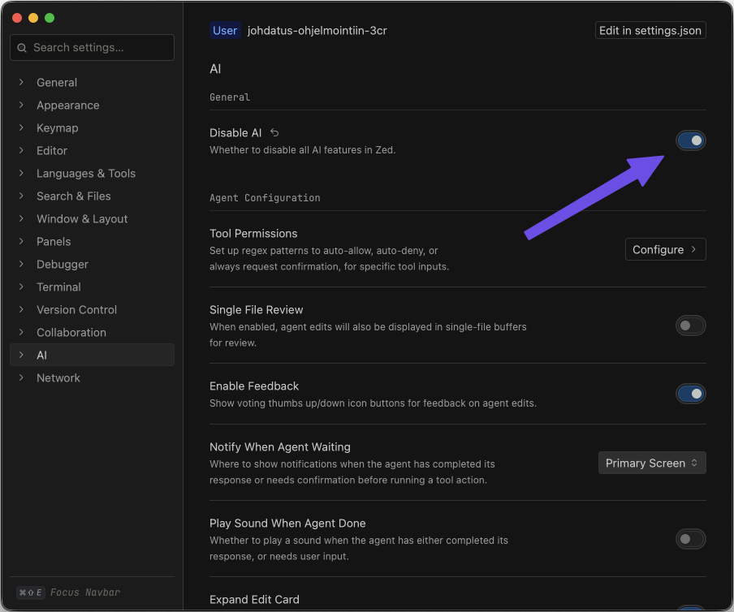
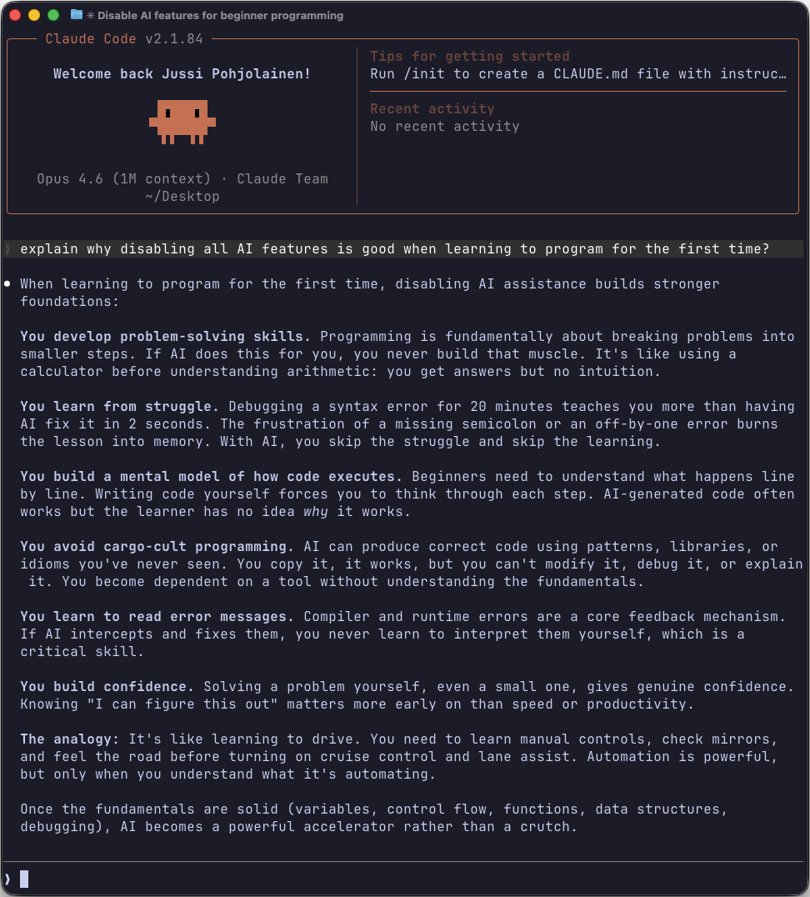

# NN00GC31-3004 Introduction to Programming: Java

This course introduces **programming fundamentals using Java**.
You will learn variables, control structures, methods, arrays, and object-oriented programming.
No prior programming experience is required.

The course consists of eight (8) assignments with automated tests and video notes.
Each assignment builds on the previous one.

## Prerequisites

- Basic computer skills are expected.
- [Command line usage](https://tkt-lapio.github.io/en/) is especially beneficial, as all exercises are compiled and run from the terminal.
- See the [Command Line Basics](CLI.md) guide for a quick introduction.

## Agenda

| Topics                                              | Assignment                     | Points  |
| --------------------------------------------------- | ------------------------------ | ------- |
| Variables, input/output, if statements, while loops | [Assignment 01](assignment01/) | 31      |
| Boolean algebra, control structures, switch         | [Assignment 02](assignment02/) | 38      |
| Strings                                             | [Assignment 03](assignment03/) | 26      |
| Arrays and Exceptions                               | [Assignment 04](assignment04/) | 37      |
| Methods                                             | [Assignment 05](assignment05/) | 48      |
| 2D arrays and Recap                                 | [Assignment 06](assignment06/) | 33      |
| Object Oriented Programming - part 1                | [Assignment 07](assignment07/) | 40      |
| Object Oriented Programming - part 2                | [Assignment 08](assignment08/) | 29      |
| **Total**                                           |                                | **282** |

## Course Requirements

1. Watch videos and submit handwritten notes (minimum 70%).
2. Complete assignments (minimum 50%).

### Handwritten Video Notes

- Each assignment includes links to short YouTube videos - write handwritten notes about these.
- Handwritten notes must be on pen and paper (not digital)
- Must include main topics from the video.
- Submit as PDFs with images of handwritten notes.
- File format: `notes/video01.pdf`, `notes/video02.pdf`, etc. Place all video note PDFs in a `notes/` subfolder inside the assignment folder.
- Language: Finnish or English.
- Incorrect filenames result in automatic rejection.
- Submit video notes together with the assignment zip.

### Required Notes per Assignment

| Assignment | Count | Files |
| ---------- | ----- | ----- |
| Assignment 01 | 6 | `notes/video01.pdf` – `notes/video06.pdf` |
| Assignment 02 | 7 | `notes/video01.pdf` – `notes/video07.pdf` |
| Assignment 03 | 3 | `notes/video01.pdf` – `notes/video03.pdf` |
| Assignment 04 | 5 | `notes/video01.pdf` – `notes/video05.pdf` |
| Assignment 05 | 3 | `notes/video01.pdf` – `notes/video03.pdf` |
| Assignment 06 | 1 | `notes/video01.pdf` |
| Assignment 07 | 5 | `notes/video01.pdf` – `notes/video05.pdf` |
| Assignment 08 | 5 | `notes/video01.pdf` – `notes/video05.pdf` |
| **Total** | **35** | |

### Assignment Submission

Submit **one zip file per assignment** (8 zips total over the course).
Each zip contains both the exercise source files and the video note PDFs for that assignment.

- Zip filename: `studentnumber-assignment0X.zip` (e.g. `12345-assignment01.zip`)
- The zip must contain a single root folder named `assignment0X/`

#### Example: assignment 01

```text
12345-assignment01.zip
  assignment01/
    01/Main.java
    01/screenshot.png
    02/Main.java
    03/Main.java
    04/Main.java
    05/Main.java
    06/Main.java
    07/Main.java
    08/Main.java
    09/Main.java
    10/Main.java
    notes/video01.pdf
    notes/video02.pdf
    notes/video03.pdf
    notes/video04.pdf
    notes/video05.pdf
    notes/video06.pdf
```

#### Example: assignment 07

In later assignments you may have multiple `.java` files per exercise:

```text
12345-assignment07.zip
  assignment07/
    01/Rectangle.java
    01/Main.java
    02/Rectangle.java
    02/Main.java
    ...
    notes/video01.pdf
    notes/video02.pdf
    notes/video03.pdf
    notes/video04.pdf
    notes/video05.pdf
```

#### Common mistakes

- Do **not** include `Test.java` files in your zip.
- Do **not** include `.class` files. Only submit `.java` source files and `.pdf` video notes.
- Do **not** zip individual files without the `assignment0X/` root folder.

#### Incorrect submission

If you notice an error after submitting (wrong files, missing exercises, incorrect filenames):

1. Fix the problem locally.
2. Re-create the zip with the correct contents.
3. Upload the corrected zip before the deadline. **The latest upload replaces the previous one.**

#### Deadlines

- Course period: `2026-05-01` to `2026-12-01`
- **Deadline:** `2026-12-01` for all assignments and notes.
- Late penalties:
  - `2026-12-02` to `2026-12-15`: automatic grade 1
  - `2026-12-16` -> **course failed, no exceptions**

## Testing Assignments

Each exercise has a `Test.java` file that checks your solution.
Keep `Test.java` in the same folder as your own source files.

### Step-by-step

1. Write your solution in the correct exercise folder.
2. Make sure `Test.java` is in the same folder as your solution files.
3. Open a terminal and navigate to that exercise folder.

**Windows (Command Prompt):**

```bash
cd C:\Users\YourName\path\to\assignment01\01
```

**macOS / Linux (Terminal):**

```bash
cd /Users/YourName/path/to/assignment01/01
```

4. Verify that your files are in the folder.

**Windows:**

```bash
dir
```

**macOS / Linux:**

```bash
ls
```

5. Run the test.

For most exercises:

```bash
java Test.java
```

If the exercise contains multiple `.java` files, compile first:

```bash
javac *.java
java Test
```

6. Check the output.
   Each test prints `PASS` or `FAIL` for each check, followed by a summary
   line.

Example:

```text
  PASS: output contains 'Hello World!'
Exercise 02: 1/1 passed
```

## Grading

Each test equals 1 point.
The grade is determined by the percentage of total assignment points.
**Minimum 50%** of total points required.
You must have returned 70% of video notes.

| Grade | Percentage |
| ----- | ---------- |
| 1     | 50%        |
| 2     | 60%        |
| 3     | 70%        |
| 4     | 80%        |
| 5     | 90%        |

## Tools

### Installing Java

Install **Eclipse Temurin 25** from the [Adoptium website](https://adoptium.net/).

#### Windows

1. Go to [https://adoptium.net/](https://adoptium.net/).
2. Download the **Windows x64** `.msi` installer for **Temurin 25**.
3. Run the installer. During installation, make sure the option **"Add to PATH"** is enabled.
4. Open **Command Prompt**: press `Win + R`, type `cmd`, and press Enter.

#### macOS

1. Go to [https://adoptium.net/](https://adoptium.net/).
2. Download the **macOS** installer (`.pkg`) for **Temurin 25**. Choose **aarch64** if you have an Apple Silicon Mac (M1/M2/M3/M4), or **x64** for an older Intel Mac.
3. Run the installer.
4. Open **Terminal**: press `Cmd + Space`, type `Terminal`, and press Enter.

#### Linux

1. Go to [https://adoptium.net/](https://adoptium.net/).
2. Download the **Linux x64** `.tar.gz` archive for **Temurin 25**.
3. Extract and add to your PATH, or use your distribution's package manager. See the [Adoptium installation guide](https://adoptium.net/installation/linux/) for details.

#### Verify Installation

Open a terminal and run:

```bash
java --version
javac --version
```

If something goes wrong, see the [FAQ: Java Installation and Setup](FAQ.md).

### Text Editors

You need a text editor to write Java code. Here are some options:

- **[Zed](https://zed.dev/)**: Fast, modern editor available for macOS, Windows, and Linux.
- **[Notepad++](https://notepad-plus-plus.org/)**: Lightweight editor for Windows. Simple and easy to use.
- **[VS Code](https://code.visualstudio.com/)**: Popular, free editor with Java support via extensions.
- **[micro](https://micro-editor.github.io/)**: Simple terminal-based editor. Easy to use, works on all platforms.
- **[IntelliJ IDEA Community Edition](https://www.jetbrains.com/idea/)**: Full-featured Java IDE, free community version available. **Not recommended for beginners:** it hides the compile/run process, its autocomplete does too much of the thinking for you, and its project structure adds unnecessary complexity for simple single-file exercises. Some video lectures may use this tool.

Any plain text editor will work. Do **not** use a word processor like Microsoft Word.

### Disabling AI Features

Many modern editors include built-in AI assistants or autocomplete powered by AI (e.g., GitHub Copilot in VS Code, AI Assistant in IntelliJ, Zed's AI features). **You must disable all AI-powered code suggestions and completions** before working on exercises.

- **Zed**: Go to `Settings` and disable AI-related features (Assistant, inline completions).
- **VS Code**: Uninstall or disable the GitHub Copilot extension. Go to Extensions (`Ctrl+Shift+X` / `Cmd+Shift+X`), search for "Copilot", and disable it.

Example of Zed settings:



## AI Policy

It is strictly **forbidden** to use AI tools to complete exercises directly.

### Allowed Uses

- Explaining concepts.
- Requesting simple study examples.
- Clarifying theory and terminology.

### Prohibited Uses

- Asking AI to complete or solve assignment tasks.
- Copying AI-generated code into submissions.

If you want to use AI as a learning aid, use [ChatGPT Study Mode](https://chatgpt.com/), which is designed to guide you through problems without giving you the answer directly.

### Why This Matters

In the future, much of programming work will involve reading, reviewing, and validating code generated by AI. However, if you do not understand the basics, you cannot effectively validate whether AI-generated code is correct, handles edge cases, or solves the right problem. The only reliable way to build that foundation is by writing code manually.

All submitted assignments are run through a plagiarism detection tool that also checks for AI-generated code.



### Privacy Notice

Never share your student ID, email, credentials, or confidential information on external AI platforms (ChatGPT, Claude, etc.).

### Course Guideline

Follow [Arene AI Traffic Light Model](https://sites.tuni.fi/vinkkipankki/tekoaly/liikennevalomalli-nain-ohjeistat-opiskelijoita-tekoalyn-kaytossa/) "Yellow Rule": "The use of AI is allowed, but it must be disclosed."

## License

> Copyright (c) 2026. All rights reserved.
>
> Permission is granted to use, copy, and share this material for non-commercial educational purposes, provided that:
>
> 1. Attribution is given to the original author.
> 2. Modified versions are shared under the same terms.
> 3. The material is **not** used, in whole or in part, to **train, fine-tune, or otherwise feed into any generative AI or machine learning system**.
>
> Commercial use requires written permission from the author.
