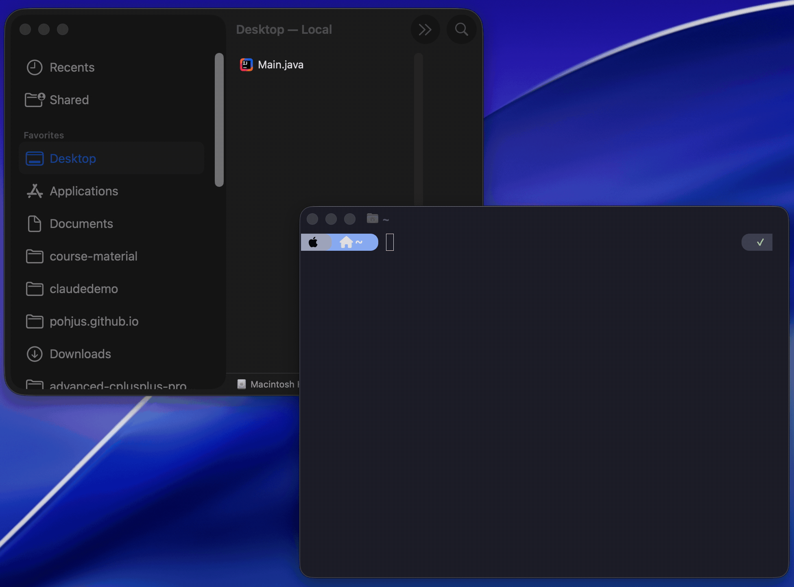

# Assignment 01

## Points Overview

| Exercise  | Description               | Points |
| --------- | ------------------------- | ------ |
| 01        | Install Java              | 1      |
| 02        | Hello World               | 1      |
| 03        | User Input and Output     | 2      |
| 04        | Two Integers and If       | 3      |
| 05        | Summation                 | 5      |
| 06        | Larger Number             | 4      |
| 07        | Age Check                 | 4      |
| 08        | Repeat User-Defined Times | 3      |
| 09        | Count 1 to 10             | 4      |
| 10        | Find the Largest Number   | 4      |
| **Total** |                           | **31** |

## Required Video Notes

Submit the following handwritten video notes with this assignment:

- `notes/video01.pdf`
- `notes/video02.pdf`
- `notes/video03.pdf`
- `notes/video04.pdf`
- `notes/video05.pdf`

## Directory Structure

Create each exercise in its own folder:

```text
assignment01/01/Main.java
assignment01/02/Main.java
...
assignment01/nn/Main.java
```

Use the concepts we've covered in class: **don't use advanced features**, even if you already know them.

See the [course README](../README.md) for tool setup, AI policy, and installation instructions.

## Java Version and Video Note

The videos in this assignment show older Java style. In those videos,
programs are often written with a class and
`public static void main(String[] args)`.

Our exercises will use **Java 25**. Java 25 allows a simpler beginner
syntax for small programs, so the code in this course is easier to read
and write.

The main ideas are still the same:

- print output
- read input
- store values in variables
- use `if` statements and loops

Only the program structure looks a little different.

### Old Java vs. New Java

Older Java style:

```java
public class Main {
    public static void main(String[] args) {
        System.out.println("Hello World!");
    }
}
```

Java 25 style used in these exercises:

```java
void main() {
    IO.println("Hello World!");
}
```

Another example with input.

Older Java style:

```java
import java.util.Scanner;

public class Main {
    public static void main(String[] args) {
        Scanner scanner = new Scanner(System.in);
        System.out.print("Enter your name: ");
        String name = scanner.nextLine();
        System.out.println("Hello, " + name + "!");
    }
}
```

Java 25 style used in these exercises:

```java
void main() {
    String name = IO.readln("Enter your name: ");
    IO.println("Hello, " + name + "!");
}
```

### Plan

When watching the videos:

1. Focus on the programming idea being taught.
2. If the video shows a class or `public static void main`, convert it to
   the simpler Java 25 style used here.
3. Write your solutions using the syntax shown in this README.

## Testing

See the shared testing instructions in the
[course README](../README.md#testing-assignments).

---

## 1. Install Java

- 📺 [Using Java from CLI (video)](https://www.youtube.com/watch?v=uA4eQbC3JgA) (length: 5:43) - submit 📝 `notes/video01.pdf`

Follow the [installation instructions](../README.md#installing-java) in the course README.

### Deliverable

Take a **screenshot** showing both `java --version` and `javac --version` producing output in your terminal. Save the screenshot as `screenshot.png` (or `.jpg`) in folder `assignment01/01/`.



### Test

- [Test.java](01/Test.java)

| #   | Test                   | Points |
| --- | ---------------------- | ------ |
| 1   | Screenshot file exists | 1      |
|     | **Total**              | **1**  |

---

## 2. Hello World

Create a file called `Main.java` in folder `assignment01/02/` with the following content:

```java
void main() {
    IO.println("Hello World!");
}
```

Notice: no class declaration is needed. Java 25 supports writing simple programs without wrapping code in a class.

### Compiling and Running

You need to navigate your terminal to the folder where `Main.java` is located before you can compile and run it.

**Windows (Command Prompt):**

```bash
cd C:\Users\YourName\path\to\assignment01\02
```

**macOS / Linux (Terminal):**

```bash
cd /Users/YourName/path/to/assignment01/02
```

**Tip (Windows):** In File Explorer, navigate to the folder and type `cmd` in the address bar, then press Enter. This opens Command Prompt directly in that folder. You can also drag a folder into the Command Prompt window to paste its path.

**Tip (macOS):** You can drag a folder from Finder into the Terminal window to paste its path.

Once you are in the correct directory, compile and run:

```bash
javac Main.java
java Main
```

You should see:

```text
Hello World!
```


### Test

- [Test.java](02/Test.java)

| #   | Test                           | Points |
| --- | ------------------------------ | ------ |
| 1   | Output contains "Hello World!" | 1      |
|     | **Total**                      | **1**  |

---

## 3. User Input and Output

- 📺 [Java variables are easy! (video)](https://www.youtube.com/watch?v=TGVLmr194DI&list=PLZPZq0r_RZOOj_NOZYq_R2PECIMglLemc&index=2) (length: 20:32) - submit 📝 `notes/video02.pdf`
- 📺 [User input in Java is easy! (video)](https://www.youtube.com/watch?v=RAthlOQUMkc&list=PLZPZq0r_RZOOj_NOZYq_R2PECIMglLemc&index=3) (length: 15:55) - submit 📝 `notes/video03.pdf`

`IO.readln` reads a line of text from the user. It takes a prompt string as a parameter and returns the user's input as a `String`.

Create the following program in `assignment01/03/` and submit it as your `Main.java`:

```java
void main() {
    String name = IO.readln("Enter your name: ");
    IO.println("Hello, " + name + "!");
}
```

### Example

```text
Enter your name: Alice
Hello, Alice!
```

```text
Enter your name: Bob
Hello, Bob!
```

You can also read numbers by converting the `String` to an `int` using `Integer.parseInt`. Try this out locally, but submit the name greeting program above as your `Main.java`:

```java
void main() {
    int number = Integer.parseInt(IO.readln("Enter a number: "));
    IO.println("You entered: " + number);
}
```

### Test

- [Test.java](03/Test.java)

| #   | Test                                              | Points |
| --- | ------------------------------------------------- | ------ |
| 1   | Output contains "Hello, Alice!" for input "Alice" | 1      |
| 2   | Output contains "Hello, Bob!" for input "Bob"     | 1      |
|     | **Total**                                         | **2**  |

---

## 4. Two Integers and If

Ask the user for two integers. If the first number is greater than the second, print `"hellurei"`.

```java
void main() {
    int a = Integer.parseInt(IO.readln("Enter first number: "));
    int b = Integer.parseInt(IO.readln("Enter second number: "));
    // Add logic here
}
```

### Example

```text
Enter first number: 7
Enter second number: 2
hellurei
```

If the first number is not greater, nothing extra is printed:

```text
Enter first number: 2
Enter second number: 7
```

- 📺 [Java if statements are easy! (video)](https://www.youtube.com/watch?v=Q_ll-EKocuI&list=PLZPZq0r_RZOOj_NOZYq_R2PECIMglLemc&index=7) (length: 13:29) - submit 📝 `notes/video04.pdf`
- [If statement (tutorial)](https://www.w3schools.com/java/java_conditions.asp)

### Test

- [Test.java](04/Test.java)

| #   | Test                                                     | Points |
| --- | -------------------------------------------------------- | ------ |
| 1   | Prints "hellurei" when first > second (7 > 2)            | 1      |
| 2   | Does not print "hellurei" when first < second (2 < 7)    | 1      |
| 3   | Does not print "hellurei" when numbers are equal (5 = 5) | 1      |
|     | **Total**                                                | **3**  |

---

## 5. Summation

Copy your previous code to folder `assignment01/05/`.

Modify the program to also print the **sum** of the two numbers. The program should still print `"hellurei"` if the first number is greater than the second.

### Example

```text
Enter first number: 3
Enter second number: 4
7
```

```text
Enter first number: 7
Enter second number: 2
hellurei
9
```

### Test

- [Test.java](05/Test.java)

| #   | Test                                                  | Points |
| --- | ----------------------------------------------------- | ------ |
| 1   | Last line is "7" (sum) for inputs 3 and 4             | 1      |
| 2   | Does not print "hellurei" when first < second (3 < 4) | 1      |
| 3   | Last line is "30" (sum) for inputs 10 and 20          | 1      |
| 4   | Prints "hellurei" when first > second (7 > 2)         | 1      |
| 5   | Last line is "9" (sum) for inputs 7 and 2             | 1      |
|     | **Total**                                             | **5**  |

---

## 6. Larger Number

Ask the user for two numbers and print the larger one. If the numbers are equal, print either one.

### Example

```text
Enter first number: 3
Enter second number: 7
7
```

```text
Enter first number: 9
Enter second number: 2
9
```

### Test

- [Test.java](06/Test.java)

| #   | Test                                | Points |
| --- | ----------------------------------- | ------ |
| 1   | Prints 7 as larger of 3 and 7       | 1      |
| 2   | Prints 9 as larger of 9 and 2       | 1      |
| 3   | Prints 200 as larger of 100 and 200 | 1      |
| 4   | Prints 5 for equal inputs 5 and 5   | 1      |
|     | **Total**                           | **4**  |

---

## 7. Age Check

Ask the user for their age. If the age is under 25, output `"you're young"`, otherwise output `"you're old"`.

### Example

```text
Enter your age: 20
you're young
```

```text
Enter your age: 30
you're old
```

```text
Enter your age: 25
you're old
```

### Test

- [Test.java](07/Test.java)

| #   | Test                                   | Points |
| --- | -------------------------------------- | ------ |
| 1   | Age 20 outputs "you're young"          | 1      |
| 2   | Age 30 outputs "you're old"            | 1      |
| 3   | Age 25 outputs "you're old" (boundary) | 1      |
| 4   | Age 1 outputs "you're young"           | 1      |
|     | **Total**                              | **4**  |

---

## 8. Repeat User-Defined Times

Ask the user for a number. Print `"Batman"` that many times using a `while` loop.

### Example

```text
Enter a number: 5
Batman
Batman
Batman
Batman
Batman
```

```text
Enter a number: 1
Batman
```

```text
Enter a number: 0
```

- 📺 [Learn Java while loops in 12 minutes! (video)](https://www.youtube.com/watch?v=ZjHJrmYknrk&list=PLZPZq0r_RZOOj_NOZYq_R2PECIMglLemc&index=21) (length: 12:24) - submit 📝 `notes/video05.pdf`
- [While loop (tutorial)](https://www.w3schools.com/java/java_while_loop.asp)

### Test

- [Test.java](08/Test.java)

| #   | Test                                 | Points |
| --- | ------------------------------------ | ------ |
| 1   | "Batman" printed 5 times for input 5 | 1      |
| 2   | "Batman" printed 1 time for input 1  | 1      |
| 3   | "Batman" printed 0 times for input 0 | 1      |
|     | **Total**                            | **3**  |

---

## 9. Count 1 to 10

Print numbers from 1 to 10 using a `while` loop.

### Expected Output

```text
1
2
3
4
5
6
7
8
9
10
```

### Test

- [Test.java](09/Test.java)

| #   | Test                           | Points |
| --- | ------------------------------ | ------ |
| 1   | Exactly 10 lines of output     | 1      |
| 2   | Numbers are in ascending order | 1      |
| 3   | First number is 1              | 1      |
| 4   | Last number is 10              | 1      |
|     | **Total**                      | **4**  |

---

## 10. Find the Largest Number

Ask the user for positive integers until they input `0` or a negative number. Print the largest number given.

### Example

```text
Enter a number: 5
Enter a number: 3
Enter a number: 8
Enter a number: 2
Enter a number: 0
8
```

```text
Enter a number: 10
Enter a number: 20
Enter a number: 5
Enter a number: -1
20
```

### Test

- [Test.java](10/Test.java)

| #   | Test                                    | Points |
| --- | --------------------------------------- | ------ |
| 1   | Largest is 8 for input [5, 3, 8, 2, 0]  | 1      |
| 2   | Largest is 1 for input [1, 0]           | 1      |
| 3   | Largest is 20 for input [10, 20, 5, -1] | 1      |
| 4   | Largest is 100 for input [100, 0]       | 1      |
|     | **Total**                               | **4**  |

---

## License

> This work is licensed under the
> **Creative Commons Attribution-NonCommercial-ShareAlike 4.0 International License (CC BY-NC-SA 4.0)**
>
> **Additional Restriction:**
> The material may **not** be used, in whole or in part, to **train, fine-tune, prompt, or otherwise feed into any generative artificial intelligence (AI) or machine learning (ML) system**, except for the author.

[Learn more about CC BY-NC-SA 4.0](https://creativecommons.org/licenses/by-nc-sa/4.0/)
