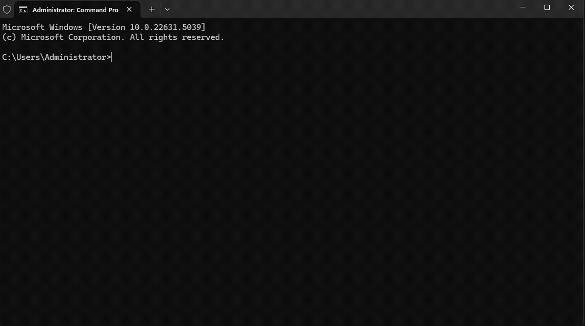

# 🧪 Assignment 01

## 📁 Directory Structure

Create each exercise in its own folder:

```
lastname-firstname-assignment01/01/Main.java
lastname-firstname-assignment01/02/Main.java
...
lastname-firstname-assignment01/0n/Main.java
```

So your directory structure could be (_change the name from `opiskelija-olli` to your name_):

```
opiskelija-olli-assignment01
├── 01
│   └── Main.java
├── 02
│   └── Main.java
└── 03
.   └── Main.java
.
```

Use the concepts we've covered in class in your exercises - **don't use advanced features**, even if you already know them.

## 🚀 Submitting Your Work

1. Zip your `lastname-firstname-assignment01` directory to `lastname-firstname-assignment01.zip`. If you do not know how zip, see [instructions](https://support.microsoft.com/en-us/windows/zip-and-unzip-files-8d28fa72-f2f9-712f-67df-f80cf89fd4e5).
1. To submit your exercises to the teacher using [dropbox file upload](https://www.dropbox.com/request/RW115dDN5GrhhTpof4y5).

# 🧩 Exercises

## 1. Compile and Run

Copy the code below into a file called `Main.java` in to directory `lastname-firstname-assignment01/01`:

```java
public class Main {
    public static void main(final String[] args) {
        System.out.println("Hello!");
    }
}
```

Compile the application:

```bash
javac Main.java
```

And then run it:

```bash
java Main
```

Change your app now that it outputs your name.

## Having problems? Step by Step instructions

### 1. Install Java (see [homepage](../index.md)) and [VS Code](https://code.visualstudio.com) if not already installed.

### 2. Open VS Code


### 3. Create new file called `Main.java` using VS Code.


### 4. Copy and paste the given Java code to new file.


Do **not** install any java extension packs.

### 5. Save this file to `lastname-firstname-assignment01/01/Main.java`.


## 6. Open command prompt (komentokehote)


You can search for "cmd", "command prompt", "komentokehote".

### 7. Move to the directory where your file is in command prompt

So for example if your file is in `C:/Users/USERNAME/Documents/lastname-firstname-assignment01/01/` then use command `cd C:/Users/USERNAME/Documents/lastname-firstname-assignment01/01/`. Use `dir` command to check that you are in the same directory where `Main.java` was saved.



### 8. Compile and run your app

Use `javac Main.java` to compile and `java Main` to run.


---

## 2. Use `if` Statement

Take the following and implement following logic: If `a` is greater than `b`, print "hellurei". Use an `if` statement.

```java
public class Main {
    public static void main(String[] args) {
        int a = 7;
        int b = 2;
        // Add logic here
    }
}
```

📺 Related: [If-statement video](https://www.youtube.com/watch?v=HQ3dCWjfRZ4&)

---

## 3. User Input

You can take user input from the end user either using

- Scanner (more compatible, less features)
- Console (newer, has more features)

### Using Scanner:

```java
import java.util.Scanner;

public class Main {
    public static void main(String[] args) {
        Scanner scanner = new Scanner(System.in);
        System.out.println("Enter a number");
        int number = Integer.parseInt(scanner.nextLine());
        System.out.println("You gave " + number);
    }
}
```

### Using Console:

```java
import java.io.Console;

public class Main {
    public static void main(String[] args) {
        Console console = System.console();
        System.out.println("Enter a number");
        int number = Integer.parseInt(console.readLine());
        System.out.println("You gave " + number);
    }
}
```

Try out both of them, do you get them to work?


**Modify**:

Ask for two integers from the end user. If the first is greater than the second, print “hellurei”. You can use either Scanner or Console.

---

## 4. Add Summation

Copy your previous code to a new directory.

Modify the previous program to also print the **sum** of the two numbers.

---

## 5. Print Larger Number

Ask the user for two numbers and print the larger one.

---

## 6. Age Check

Ask the user for their age. If age is under 25 output “you're young”, otherwise output “you're old”.

---

## 7. Repeat Message

Print _"Batman"_ String three times using a `while` loop.

📺 Related: [While-loop video](https://www.youtube.com/watch?v=v-K-4KuA8mQ&)

---

## 8. Repeat User-Defined Times

Ask for a number. Print "Batman" user given amount. So if user gave 5, output

```sh
Batman
Batman
Batman
Batman
Batman
```

---

## 11. Count 1 to 10

Print numbers from 1 to 10 using a while loop.

---

## 12. Count 10 to 1

Print numbers from 10 to 1 using a while loop.

---

## 13. 🔁 Extra Challenge

Ask the user for positive integers until they input 0 or a negative number. Print the largest number given.
