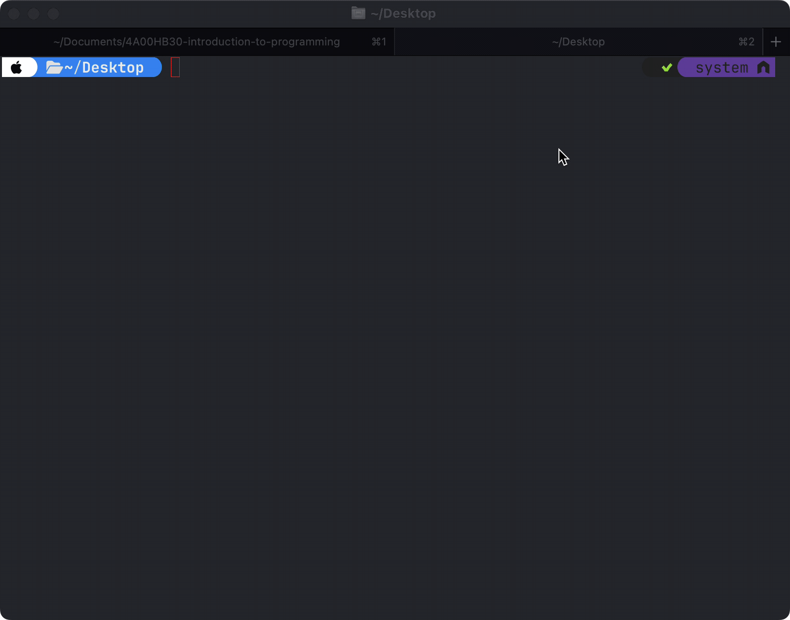

# ☕ Introduction to Programming (`5S00DX90-3018`)

## 🧑‍💻 Trainer

- Jussi Pohjolainen, [`jussi.pohjolainen@tuni.fi`](mailto:jussi.pohjolainen@tuni.fi)

## 💼 Implementation Plan

- See [3018](https://tamk-study-guide.tuni.fi/realization/TODO).

## 📅 Agenda

| **Session** | **Date**     | **Time**    | **Topic**                                                                                                                                       |
| ----------: | ------------ | ----------- | ----------------------------------------------------------------------------------------------------------------------------------------------- |
|           1 | `2025-10-24` | 08:15–11:00 | Course introduction – overview of the learning environment and tools. Introduction to programming fundamentals and the Java language.           |
|           2 | `2025-11-07` | 08:15–11:00 | Variables, data types, and operators. Basic statements and arithmetic operations. Practical exercises to apply core concepts.                   |
|           3 | `2025-11-14` | 08:15–11:00 | Introduction to control structures: conditional statements (if, switch) and loops (for, while, do-while) with practical examples and exercises. |
|           4 | `2025-11-28` | 08:15–11:00 | Arrays and methods – essential core concepts.                                                                                                   |
|           5 | `2025-12-12` | 08:15–11:00 | Final code review. Conducting exams.                                                                                                            |

## 🎯 Instructions for Earning Exercise Points

- See [Exercise Point Guidelines](https://github.com/pohjus/common-course-assets/blob/main/exercise-points-guidelines.md).
- You do not need to use git, just upload your exercises to dropbox file upload.

## ⚙️ Java Installation

### Step 1: Go to the Adoptium Website

1. Open your browser.
2. Visit: [https://adoptium.net](https://adoptium.net)

### Step 2: Download the Windows Installer

1. On the homepage, find the download section.
2. **Select the LTS version** (e.g., **Java 21** or **Java 25**).
3. Make sure the OS is **Windows** and the architecture is **x64**.
4. Click **"Download JDK"** — select the **MSI Installer** option.

### Step 3: Run the Installer

1. Open the downloaded `.msi` file.
2. Proceed through the installer wizard:
   - Accept the license agreement.
   - Choose an install location (default is fine).
   - ✅ Enable _“Set JAVA_HOME environment variable”_.
   - ✅ Enable _“Add to PATH”_.
3. Click **Install**, then **Finish**.

### Step 4: Verify the Installation

Open **Command Prompt** and type:

```sh
javac -version
```

and

```sh
java -version
```

Expected output:

```sh
openjdk version "24" 2025-03-18
OpenJDK Runtime Environment Temurin-24+36 (build 24+36)
OpenJDK 64-Bit Server VM Temurin-24+36 (build 24+36, mixed mode, sharing)
```

Example:


