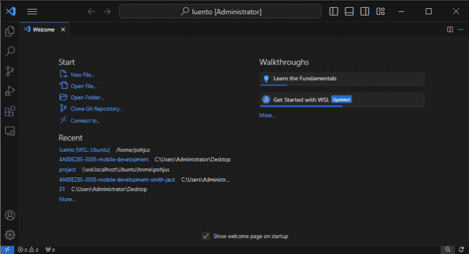
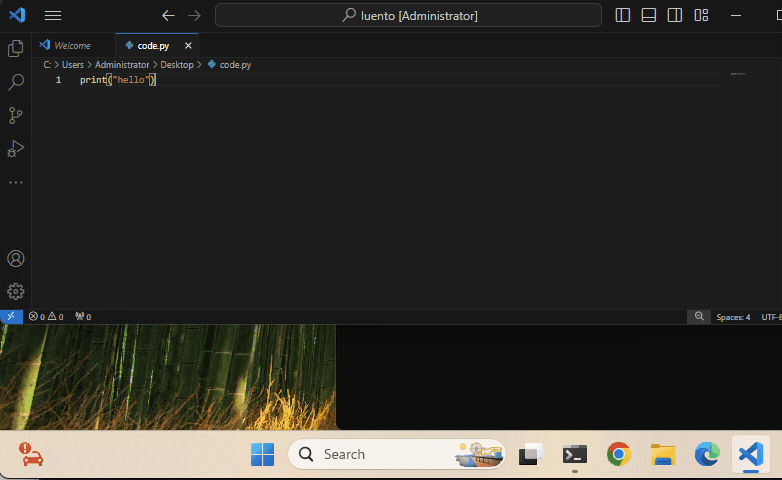

# 🧪 Assignment 02

## 📁 Directory Structure

Create each exercise in its own folder:

```
lastname-firstname-assignment02/e01.py
lastname-firstname-assignment02/e02.py
...
lastname-firstname-assignment02/e23.py
```

So your directory structure could be (_change the name from `opiskelija-olli` to your name_):

```
opiskelija-olli-assignment02
├── e01.py
├── e02.py
├── e03.py
...
├── e23.py
```

Avoid scandinavian characters.

Zip your `lastname-firstname-assignment02` directory to `lastname-firstname-assignment02.zip`. Example of wrong file names:

```
# firstname-lastname:
matti-meikalainen-assignment02.zip

# scandinavian chars:
meikäläinen-matti-assignment02.zip

# uppercase chars ('M' is different than 'm')
Meikalainen-Matti-assigment02.zip
```

There is an application that checks your assignments, if you have a wrong name the app won't work!

---

⚠️ Use the concepts we've covered in class in your exercises - **don't use advanced features**, even if you already know them.

## 🚀 Submitting Your Work

1. Zip your `lastname-firstname-assignment02` directory to `lastname-firstname-assignment02.zip`. If you do not know how to zip, see [instructions](https://support.microsoft.com/en-us/windows/.zip-and-unzip-files-8d28fa72-f2f9-712f-67df-f80cf89fd4e5).
2. To submit your exercises to the teacher use [dropbox file upload](https://www.dropbox.com/request/WenoWd5sGzH4f8Fv0hIL).
3. Mark your exercises in Google Sheets (link in Moodle)
4. Be prepared to participate on code review where you may have to explain your solutions in the class.
5. Be on time on lectures, **latecomers do not get points**.
6. See general [guidelines](https://github.com/pohjus/common-course-assets/blob/main/exercise-points-guidelines.md) for the exercises.

## 💻 How to run and test your apps?

**Windows:** Create new text file using VS Code and save it
for example to Desktop using some name the ends with `.py`, for example `code.py`, or `e01.py`. It can be whatever:



Open terminal app (Pääte) or cmd and go the the directory you have saved the file. Desktop can be found from `\Desktop\` (win) or `~/Desktop/` (mac) Then run your app using command `python yourcodefile.py` (win) or `py yourcodefile.py` (win) or `python3 yourcodefile.py` (mac).

⚠️ If you have OneDrive then Desktop can be found by giving command `cd OneDrive\Desktop`.


Make modifications to your code, save it and run it again in command prompt or terminal giving your run command.



## 🧩 Exercises

_The tasks are not in order of difficulty. If you get stuck on a task, move on to the next one and you can return to the more difficult ones later!_

See following for help: [W3Schools Python tutorial](https://www.w3schools.com/python/default.asp).

---

### Assignment 01: Christmas Greeting

> See [Conditions tutorial](https://www.w3schools.com/python/python_conditions.asp).

Ask for the day and month. If the date is December 24th, print "Merry Christmas!". Otherwise do not print anything

Example:

```bash
Enter day:
24
Enter month:
12
Merry Christmas!
```

### Assignment 02: Special Age for a Dog

Ask for a dog's age. If it's under 3 or over 10, print `"The dog is at a special age."`

### Assignment 03: Working Hours

Ask for the hour of the day. If it is between 9 and 17 (inclusive), print `"Working hours in progress!"`.

### Assignment 04: While Loops - Counting

> See [while loops tutorial](https://www.w3schools.com/python/python_while_loops.asp).

Implement four while loops to output

- 1 → 10
- 5 → 15
- 10 → 0
- every second number from 10 → 0

### Assignment 05: For Loops

> See [for loops tutorial](https://www.w3schools.com/python/python_for_loops.asp).

Implemnt previous using for loops and `range()`.

### Assignment 06: Multiplication Using Sum

Ask two integers. Multiply them by repeated addition:

```python
Enter first number:
2
Enter second number:
4
Result:
8
```

So do not use `*` use `+` to calculae the multiplication. Example

```python
# count "3 * 5" using '+':

result = 0
result = result + 5
result = result + 5
result = result + 5
print(result) # 15
```

### Assignment 07: Input Validation with Loop

> See [match case tutorial](https://www.w3schools.com/python/python_match.asp).

Using match-case, map 1-7 to weekdays.
So ask number from 1 - 7 and then output `monday` (1), `tuesday`(2) etc.

### Assignment 08: Input Validation with Loop

Ask for score (0-60). Print grade according to:

| Grade      | Score Range |
| ---------- | ----------- |
| improbatur | 0-8         |
| approbatur | 9-16        |
| lubenter   | 17-24       |
| cum laude  | 25-35       |
| magna      | 36-44       |
| eximia     | 45-52       |
| laudatur   | 53-60       |

Do not use match-case.

### Assignment 09: Input Validation with Loop

Ask user for a number 1-7. Keep asking until valid input is given. Example

```python
give number: -1
give number: 12
give number: 0
give number: 4
you gave number 4
```

### Assignment 10: One Line of Xs

Ask width. Print one line:

```bash
Enter width:
4
XXXX
```

Use `for` or `while` to do the repetition.

### Assignment 11: Square

Ask height:

```bash
Enter height:
3
XXX
XXX
XXX
```

Use `for` or `while` to do the repetition.

### 🤓 Extra 12: Go to the Pub

Ask:

- Hour (0-23)
- Minute (0-59)
- Money in euros

If:

- Time is between 12:00 and 03:29 (next day)
- Money is at least 5€

Then print:

```bash
Ale pup is open from 12 to 03:29. Beer costs 5€. Go to the pub.
```

Tip: use variables like `isMoneyOk`, `isTimeOk`.

### 🤓 Extra 13: RPS

Ask user for rock, papers or scissors. Then computer picks randomly the same:

```python
import random
choice = random.choice(["rock", "paper", "scissors"])
```

Loop the RPS game until either player wins 2 out of 3.
Output the winner.

---

## License

> This work is licensed under the
> **Creative Commons Attribution-NonCommercial-ShareAlike 4.0 International License (CC BY-NC-SA 4.0)**
>
> ⚠️ **Additional Restriction:**
> The material may **not** be used, in whole or in part, to **train, fine-tune, prompt, or otherwise feed into any generative artificial intelligence (AI) or machine learning (ML) system.** expect by the author.

🔗 [Learn more about CC BY-NC-SA 4.0](https://creativecommons.org/licenses/by-nc-sa/4.0/)
