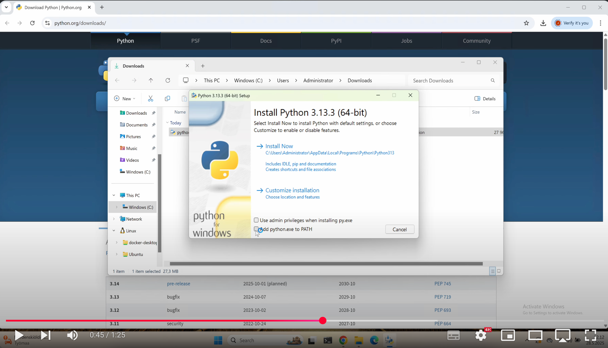

# Install Python

## License

> This work is licensed under the
> **Creative Commons Attribution-NonCommercial-ShareAlike 4.0 International License (CC BY-NC-SA 4.0)**
>
> ⚠️ **Additional Restriction:**
> The material may **not** be used, in whole or in part, to **train, fine-tune, prompt, or otherwise feed into any generative artificial intelligence (AI) or machine learning (ML) system).**

🔗 [Learn more about CC BY-NC-SA 4.0](https://creativecommons.org/licenses/by-nc-sa/4.0/)

### Install Python

🎦 See how to install **Python on Windows**:

[](https://www.youtube.com/watch?v=1EvBXhSWGnk)

> [`https://youtu.be/1EvBXhSWGnk`](https://youtu.be/1EvBXhSWGnk)

⚠️ Do not install from Microsoft Store — it can cause conflicts! Uninstall previous
Python if you have one.

Here are more detailed instructions in text-format, also **macOS** is covered.

---

#### Windows

##### Step 1: Download Python Installer

- Go to the official Python website:
  - [`https://www.python.org/downloads/windows/`](https://www.python.org/downloads/windows/)
- Click on **“Download Python 3.x.x”** under the latest stable release for Windows.

---

##### Step 2: Run the Installer with Correct Options

0. If you have previous version of Python installed, uninstall that.
1. **Double-click** the downloaded installer (`python-3.x.x.exe`).
2. Before clicking **Install Now**, **check this box**: `[x] Add Python to PATH`

> This ensures you can run `python` and `pip` from any directory in Command Prompt.

3. Click: `[Install Now]`

4. Wait for the installation to finish.

---

##### Step 3: Verify Installation in Command Prompt

1. Open **Command Prompt** (`Win + R` → type `cmd` → press Enter)
2. Type and run:

```bash
python -V
```

You should see:

```bash
Python 3.x.x
```

#### macOS

Install first [Homebrew](https://brew.sh) (if not already installed). With Homebrew you can install apps via terminal.

To install homebrew, give following command in **terminal**-application:

```bash
/bin/bash -c "$(curl -fsSL https://raw.githubusercontent.com/Homebrew/install/HEAD/install.sh)"
```


And then install python:

```bash
brew update
brew install python
brew install python-tk@3.XX # CHECK the version here
python3 -m tkinter
```

Test using

```bash
python3 -V
```


