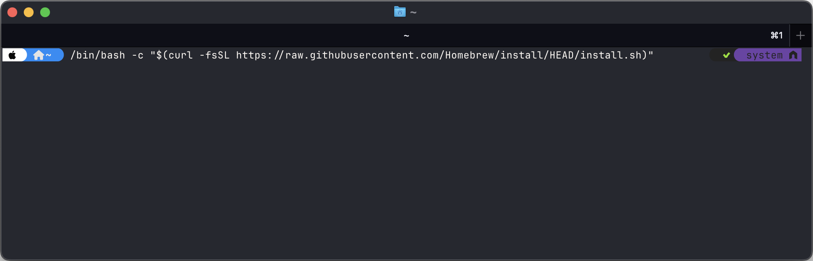
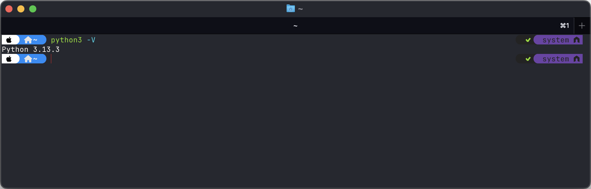

# 🧪 Assignment 01

## 📁 Directory Structure

Create each exercise in its own folder:

```
lastname-firstname-assignment01/e01.py
lastname-firstname-assignment01/e02.py
...
lastname-firstname-assignment01/e23.py
```

So your directory structure could be (_change the name from `opiskelija-olli` to your name_):

```
opiskelija-olli-assignment01
├── e01.py
├── e02.py
├── e03.py
...
├── e23.py
```

⚠️ Use the concepts we've covered in class in your exercises - **don't use advanced features**, even if you already know them.

## 🚀 Submitting Your Work

1. Zip your `lastname-firstname-assignment01` directory to `lastname-firstname-assignment01.zip`. If you do not know how to zip, see [instructions](https://support.microsoft.com/en-us/windows/.zip-and-unzip-files-8d28fa72-f2f9-712f-67df-f80cf89fd4e5).
2. To submit your exercises to the teacher use [dropbox file upload](https://www.dropbox.com/request/WenoWd5sGzH4f8Fv0hIL).
3. Mark your exercises in Google Sheets (link in Slack)
4. Be prepared to participate on code review where you may have to explain your solutions in the class.
5. Be on time on lectures, **latecomers do not get points**.
6. See general [guidelines](https://github.com/pohjus/common-course-assets/blob/main/exercise-points-guidelines.md) for the exercises.

## 🧠 AI Usage?

⚠️ Usage of AI is prohibited in these exercises.

In **early programming education**, students must develop computational thinking, which includes:

- Breaking down problems (decomposition)
- Recognizing patterns
- Writing logic step-by-step
- Understanding control flow and basic data structures

If AI tools provide code or explanations too early, **students skip the struggle that leads to deep understanding**.

Also much of early programming learning comes from:

- Making mistakes
- Reading error messages
- Fixing bugs

This iterative process builds **resilience and autonomy**. If students use AI to avoid mistakes, they miss this essential skill-building.

## 🧩 Exercises

### Assignment 01: Install Python (1 point)

🎦 See how to install **Python on Windows**:

[](https://www.youtube.com/watch?v=YOUR_VIDEO_ID)

> [`https://youtu.be/1EvBXhSWGnk`](https://youtu.be/1EvBXhSWGnk)

Also same steps provided below if you prefer text over video. If you have **macOS**, see instructions below.

#### Windows

##### Step 1: Download Python Installer

- Go to the official Python website:
  - [https://www.python.org/downloads/windows/](https://www.python.org/downloads/windows/)
- Click on **“Download Python 3.x.x”** under the latest stable release for Windows.

---

##### Step 2: Run the Installer with Correct Options

0. If you have previous version of Python installed, uninstall that.
1. **Double-click** the downloaded installer (`python-3.x.x.exe`).
2. Before clicking **Install Now**, **check this box**: `[x] Add Python to PATH`

> This ensures you can run `python` and `pip` from any directory in Command Prompt.

3. Click: `[Install Now]`

4. Wait for the installation to finish.

---

##### Step 3: Verify Installation in Command Prompt

1. Open **Command Prompt** (`Win + R` → type `cmd` → press Enter)
2. Type and run:

```bash
python -V
```

You should see:

```bash
Python 3.x.x
```

#### macOS

Install first [Homebrew](https://brew.sh) (if not already installed). With Homebrew you can install apps via terminal.

To install homebrew, give command:

```bash
/bin/bash -c "$(curl -fsSL https://raw.githubusercontent.com/Homebrew/install/HEAD/install.sh)"
```



And then install python:

```bash
brew update
brew install python
brew install python-tk@3.XX # CHECK the version here
python3 -m tkinter
```

Test using

```bash
python3 -V
```



### Assignments 02: Introduction to Programming (23 points)

Go through following tutorial. You do not need to use git (opposite to the instructions in the tutorial), just upload the assignments using [dropbox file upload](https://www.dropbox.com/request/WenoWd5sGzH4f8Fv0hIL).

    https://interesting-manatee-928.notion.site/Python-tutoriaali-4f1451b232694c0f8257a98d3699b5c0

You will have 23 small exercises.
